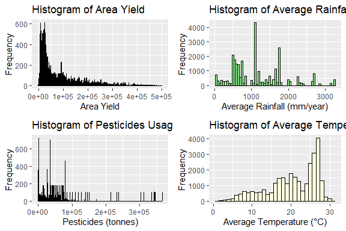
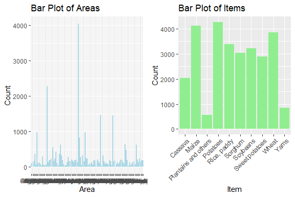

Crop Yield Prediction
================
Trevor Okinda
2024

- [Student Details](#student-details)
- [Setup Chunk](#setup-chunk)
- [Understanding the Dataset (Exploratory Data Analysis
  (EDA))](#understanding-the-dataset-exploratory-data-analysis-eda)
  - [Loading the Dataset](#loading-the-dataset)
    - [Source:](#source)
    - [Reference:](#reference)
- [Exploratory Data Analysis](#exploratory-data-analysis)
  - [Load dataset](#load-dataset)
  - [Measures of Frequency](#measures-of-frequency)
  - [Measures of Central Tendency](#measures-of-central-tendency)
  - [Measures of Distribution](#measures-of-distribution)
  - [Measures of relationship](#measures-of-relationship)
  - [ANOVA](#anova)
  - [Plots](#plots)
- [Preprocessing and Data
  Transformation](#preprocessing-and-data-transformation)
  - [Missing values](#missing-values)
  - [Transformation](#transformation)
- [Training Model](#training-model)
  - [Data Splitting](#data-splitting)
  - [Bootstrapping](#bootstrapping)
  - [Cross-validation](#cross-validation)
  - [Training Model](#training-model-1)
  - [Performance comparison](#performance-comparison)
  - [Saving Model](#saving-model)

# Student Details

|                       |                       |
|-----------------------|-----------------------|
| **Student ID Number** | 134780                |
| **Student Name**      | Trevor Okinda         |
| **BBIT 4.2 Group**    | C                     |
| **Project Name**      | Crop Yield Prediction |

# Setup Chunk

**Note:** the following KnitR options have been set as the global
defaults: <BR>
`knitr::opts_chunk$set(echo = TRUE, warning = FALSE, eval = TRUE, collapse = FALSE, tidy = TRUE)`.

More KnitR options are documented here
<https://bookdown.org/yihui/rmarkdown-cookbook/chunk-options.html> and
here <https://yihui.org/knitr/options/>.

# Understanding the Dataset (Exploratory Data Analysis (EDA))

## Loading the Dataset

### Source:

The dataset that was used can be downloaded here: *\<<a
href="https://www.kaggle.com/datasets/patelris/crop-yield-prediction-dataset\"
class="uri">https://www.kaggle.com/datasets/patelris/crop-yield-prediction-dataset\</a>\>*

### Reference:

*\<Food and Agriculture Organization & World Data Bank. (n.d.). Crop
Yield Prediction Dataset. Retrieved from <http://www.fao.org/home/en/>
and <a href="https://data.worldbank.org/\"
class="uri">https://data.worldbank.org/\</a>\>  
Refer to the APA 7th edition manual for rules on how to cite datasets:
<https://apastyle.apa.org/style-grammar-guidelines/references/examples/data-set-references>*

# Exploratory Data Analysis

## Load dataset

``` r
# Load dataset
crop_data <- read.csv("yield_df.csv", colClasses = c(
  id = "integer",
  Area = "factor",
  Item = "factor",
  Year = "integer",
  area_yield = "integer",
  average_rain_fall_mm_per_year = "integer",
  pesticides_tonnes = "numeric",
  avg_temp = "numeric"
))

# Display the structure of the dataset
str(crop_data)
```

    ## 'data.frame':    28242 obs. of  8 variables:
    ##  $ id                           : int  0 1 2 3 4 5 6 7 8 9 ...
    ##  $ Area                         : Factor w/ 101 levels "Albania","Algeria",..: 1 1 1 1 1 1 1 1 1 1 ...
    ##  $ Item                         : Factor w/ 10 levels "Cassava","Maize",..: 2 4 5 6 7 9 2 4 5 6 ...
    ##  $ Year                         : int  1990 1990 1990 1990 1990 1990 1991 1991 1991 1991 ...
    ##  $ area_yield                   : int  36613 66667 23333 12500 7000 30197 29068 77818 28538 6667 ...
    ##  $ average_rain_fall_mm_per_year: int  1485 1485 1485 1485 1485 1485 1485 1485 1485 1485 ...
    ##  $ pesticides_tonnes            : num  121 121 121 121 121 121 121 121 121 121 ...
    ##  $ avg_temp                     : num  16.4 16.4 16.4 16.4 16.4 ...

``` r
# View the first few rows of the dataset
head(crop_data)
```

    ##   id    Area        Item Year area_yield average_rain_fall_mm_per_year
    ## 1  0 Albania       Maize 1990      36613                          1485
    ## 2  1 Albania    Potatoes 1990      66667                          1485
    ## 3  2 Albania Rice, paddy 1990      23333                          1485
    ## 4  3 Albania     Sorghum 1990      12500                          1485
    ## 5  4 Albania    Soybeans 1990       7000                          1485
    ## 6  5 Albania       Wheat 1990      30197                          1485
    ##   pesticides_tonnes avg_temp
    ## 1               121    16.37
    ## 2               121    16.37
    ## 3               121    16.37
    ## 4               121    16.37
    ## 5               121    16.37
    ## 6               121    16.37

``` r
# View the dataset in a separate viewer window
View(crop_data)
```

## Measures of Frequency

``` r
# Calculate frequency of each category in 'Area' column
area_freq <- table(crop_data$Area)
print(area_freq)
```

    ## 
    ##                  Albania                  Algeria                   Angola 
    ##                       99                      114                      164 
    ##                Argentina                  Armenia                Australia 
    ##                      368                       63                      966 
    ##                  Austria               Azerbaijan                  Bahamas 
    ##                       96                      116                       67 
    ##                  Bahrain               Bangladesh                  Belarus 
    ##                       29                      294                       63 
    ##                  Belgium                 Botswana                   Brazil 
    ##                       39                       64                     2277 
    ##                 Bulgaria             Burkina Faso                  Burundi 
    ##                      138                      184                      207 
    ##                 Cameroon                   Canada Central African Republic 
    ##                      230                      552                      161 
    ##                    Chile                 Colombia                  Croatia 
    ##                      230                      414                      105 
    ##                  Denmark       Dominican Republic                  Ecuador 
    ##                       50                      368                      621 
    ##                    Egypt              El Salvador                  Eritrea 
    ##                      322                      184                       80 
    ##                  Estonia                  Finland                   France 
    ##                       42                       46                      138 
    ##                  Germany                    Ghana                   Greece 
    ##                      270                      155                      161 
    ##                Guatemala                   Guinea                   Guyana 
    ##                      204                      171                      124 
    ##                    Haiti                 Honduras                  Hungary 
    ##                      184                      204                      138 
    ##                    India                Indonesia                     Iraq 
    ##                     4048                      828                      276 
    ##                  Ireland                    Italy                  Jamaica 
    ##                       46                      322                      161 
    ##                    Japan               Kazakhstan                    Kenya 
    ##                      966                      252                      230 
    ##                   Latvia                  Lebanon                  Lesotho 
    ##                       42                       92                       92 
    ##                    Libya                Lithuania               Madagascar 
    ##                      138                       63                      184 
    ##                   Malawi                 Malaysia                     Mali 
    ##                      171                       93                      207 
    ##               Mauritania                Mauritius                   Mexico 
    ##                      161                      101                     1472 
    ##               Montenegro                  Morocco               Mozambique 
    ##                       24                      322                      161 
    ##                  Namibia                    Nepal              Netherlands 
    ##                       82                      115                       69 
    ##              New Zealand                Nicaragua                    Niger 
    ##                       92                      183                      161 
    ##                   Norway                 Pakistan         Papua New Guinea 
    ##                       46                     1449                      161 
    ##                     Peru                   Poland                 Portugal 
    ##                      207                       78                      138 
    ##                    Qatar                  Romania                   Rwanda 
    ##                       69                      138                      207 
    ##             Saudi Arabia                  Senegal                 Slovenia 
    ##                      184                      138                       84 
    ##             South Africa                    Spain                Sri Lanka 
    ##                      644                      483                      184 
    ##                    Sudan                 Suriname                   Sweden 
    ##                       28                      138                       46 
    ##              Switzerland               Tajikistan                 Thailand 
    ##                       92                      125                      161 
    ##                  Tunisia                   Turkey                   Uganda 
    ##                       69                      625                      207 
    ##                  Ukraine           United Kingdom                  Uruguay 
    ##                      126                      230                      161 
    ##                   Zambia                 Zimbabwe 
    ##                      184                      184

``` r
# Calculate frequency of each category in 'Item' column
item_freq <- table(crop_data$Item)
print(item_freq)
```

    ## 
    ##              Cassava                Maize Plantains and others 
    ##                 2045                 4121                  556 
    ##             Potatoes          Rice, paddy              Sorghum 
    ##                 4276                 3388                 3039 
    ##             Soybeans       Sweet potatoes                Wheat 
    ##                 3223                 2890                 3857 
    ##                 Yams 
    ##                  847

``` r
# Summary statistics for 'area_yield' column
summary(crop_data$area_yield)
```

    ##    Min. 1st Qu.  Median    Mean 3rd Qu.    Max. 
    ##      50   19919   38295   77053  104677  501412

``` r
# Summary statistics for 'average_rain_fall_mm_per_year' column
summary(crop_data$average_rain_fall_mm_per_year)
```

    ##    Min. 1st Qu.  Median    Mean 3rd Qu.    Max. 
    ##      51     593    1083    1149    1668    3240

``` r
# Summary statistics for 'pesticides_tonnes' column
summary(crop_data$pesticides_tonnes)
```

    ##    Min. 1st Qu.  Median    Mean 3rd Qu.    Max. 
    ##       0    1702   17529   37077   48688  367778

``` r
# Summary statistics for 'avg_temp' column
summary(crop_data$avg_temp)
```

    ##    Min. 1st Qu.  Median    Mean 3rd Qu.    Max. 
    ##    1.30   16.70   21.51   20.54   26.00   30.65

## Measures of Central Tendency

``` r
# Define a function to calculate mode
Mode <- function(x) {
  ux <- unique(x)
  ux[which.max(tabulate(match(x, ux)))]
}

# Calculate mean, median, and mode for numerical variables

# Mean, median, and mode for 'area_yield' column
mean_area_yield <- mean(crop_data$area_yield)
median_area_yield <- median(crop_data$area_yield)
mode_area_yield <- Mode(crop_data$area_yield)

# Mean, median, and mode for 'average_rain_fall_mm_per_year' column
mean_rainfall <- mean(crop_data$average_rain_fall_mm_per_year)
median_rainfall <- median(crop_data$average_rain_fall_mm_per_year)
mode_rainfall <- Mode(crop_data$average_rain_fall_mm_per_year)

# Mean, median, and mode for 'pesticides_tonnes' column
mean_pesticides <- mean(crop_data$pesticides_tonnes)
median_pesticides <- median(crop_data$pesticides_tonnes)
mode_pesticides <- Mode(crop_data$pesticides_tonnes)

# Mean, median, and mode for 'avg_temp' column
mean_temp <- mean(crop_data$avg_temp)
median_temp <- median(crop_data$avg_temp)
mode_temp <- Mode(crop_data$avg_temp)

# Print results
cat("Mean, Median, and Mode for 'area_yield' column:\n")
```

    ## Mean, Median, and Mode for 'area_yield' column:

``` r
cat("Mean:", mean_area_yield, "Median:", median_area_yield, "Mode:", mode_area_yield, "\n\n")
```

    ## Mean: 77053.33 Median: 38295 Mode: 10000

``` r
cat("Mean, Median, and Mode for 'average_rain_fall_mm_per_year' column:\n")
```

    ## Mean, Median, and Mode for 'average_rain_fall_mm_per_year' column:

``` r
cat("Mean:", mean_rainfall, "Median:", median_rainfall, "Mode:", mode_rainfall, "\n\n")
```

    ## Mean: 1149.056 Median: 1083 Mode: 1083

``` r
cat("Mean, Median, and Mode for 'pesticides_tonnes' column:\n")
```

    ## Mean, Median, and Mode for 'pesticides_tonnes' column:

``` r
cat("Mean:", mean_pesticides, "Median:", median_pesticides, "Mode:", mode_pesticides, "\n\n")
```

    ## Mean: 37076.91 Median: 17529.44 Mode: 1597

``` r
cat("Mean, Median, and Mode for 'avg_temp' column:\n")
```

    ## Mean, Median, and Mode for 'avg_temp' column:

``` r
cat("Mean:", mean_temp, "Median:", median_temp, "Mode:", mode_temp, "\n\n")
```

    ## Mean: 20.54263 Median: 21.51 Mode: 27.2

## Measures of Distribution

``` r
# Load required library for skewness and kurtosis calculation
library(e1071)

# Calculate measures of distribution for numerical variables

# Variance and standard deviation for 'area_yield' column
var_area_yield <- var(crop_data$area_yield)
sd_area_yield <- sd(crop_data$area_yield)

# Variance and standard deviation for 'average_rain_fall_mm_per_year' column
var_rainfall <- var(crop_data$average_rain_fall_mm_per_year)
sd_rainfall <- sd(crop_data$average_rain_fall_mm_per_year)

# Variance and standard deviation for 'pesticides_tonnes' column
var_pesticides <- var(crop_data$pesticides_tonnes)
sd_pesticides <- sd(crop_data$pesticides_tonnes)

# Variance and standard deviation for 'avg_temp' column
var_temp <- var(crop_data$avg_temp)
sd_temp <- sd(crop_data$avg_temp)

# Skewness and kurtosis for 'area_yield' column
skew_area_yield <- skewness(crop_data$area_yield)
kurt_area_yield <- kurtosis(crop_data$area_yield)

# Skewness and kurtosis for 'average_rain_fall_mm_per_year' column
skew_rainfall <- skewness(crop_data$average_rain_fall_mm_per_year)
kurt_rainfall <- kurtosis(crop_data$average_rain_fall_mm_per_year)

# Skewness and kurtosis for 'pesticides_tonnes' column
skew_pesticides <- skewness(crop_data$pesticides_tonnes)
kurt_pesticides <- kurtosis(crop_data$pesticides_tonnes)

# Skewness and kurtosis for 'avg_temp' column
skew_temp <- skewness(crop_data$avg_temp)
kurt_temp <- kurtosis(crop_data$avg_temp)

# Print results
cat("Measures of Distribution for 'area_yield' column:\n")
```

    ## Measures of Distribution for 'area_yield' column:

``` r
cat("Variance:", var_area_yield, "Standard Deviation:", sd_area_yield, "Skewness:", skew_area_yield, "Kurtosis:", kurt_area_yield, "\n\n")
```

    ## Variance: 7217626075 Standard Deviation: 84956.61 Skewness: 1.793038 Kurtosis: 3.06493

``` r
cat("Measures of Distribution for 'average_rain_fall_mm_per_year' column:\n")
```

    ## Measures of Distribution for 'average_rain_fall_mm_per_year' column:

``` r
cat("Variance:", var_rainfall, "Standard Deviation:", sd_rainfall, "Skewness:", skew_rainfall, "Kurtosis:", kurt_rainfall, "\n\n")
```

    ## Variance: 503833.3 Standard Deviation: 709.8121 Skewness: 0.8537413 Kurtosis: 0.306559

``` r
cat("Measures of Distribution for 'pesticides_tonnes' column:\n")
```

    ## Measures of Distribution for 'pesticides_tonnes' column:

``` r
cat("Variance:", var_pesticides, "Standard Deviation:", sd_pesticides, "Skewness:", skew_pesticides, "Kurtosis:", kurt_pesticides, "\n\n")
```

    ## Variance: 3595055859 Standard Deviation: 59958.78 Skewness: 3.489918 Kurtosis: 14.00338

``` r
cat("Measures of Distribution for 'avg_temp' column:\n")
```

    ## Measures of Distribution for 'avg_temp' column:

``` r
cat("Variance:", var_temp, "Standard Deviation:", sd_temp, "Skewness:", skew_temp, "Kurtosis:", kurt_temp, "\n\n")
```

    ## Variance: 39.84199 Standard Deviation: 6.312051 Skewness: -0.7415035 Kurtosis: -0.4175057

## Measures of relationship

``` r
# Calculate Pearson correlation coefficients between numerical variables
correlation_matrix <- cor(crop_data[, c("area_yield", "average_rain_fall_mm_per_year", "pesticides_tonnes", "avg_temp")])
print(correlation_matrix)
```

    ##                                  area_yield average_rain_fall_mm_per_year
    ## area_yield                     1.0000000000                  0.0009621545
    ## average_rain_fall_mm_per_year  0.0009621545                  1.0000000000
    ## pesticides_tonnes              0.0640850877                  0.1809836464
    ## avg_temp                      -0.1147769596                  0.3130395215
    ##                               pesticides_tonnes    avg_temp
    ## area_yield                           0.06408509 -0.11477696
    ## average_rain_fall_mm_per_year        0.18098365  0.31303952
    ## pesticides_tonnes                    1.00000000  0.03094611
    ## avg_temp                             0.03094611  1.00000000

``` r
# Create contingency table for categorical variables 'Area' and 'Item'
contingency_table <- table(crop_data$Area, crop_data$Item)
print(contingency_table)
```

    ##                           
    ##                            Cassava Maize Plantains and others Potatoes
    ##   Albania                        0    23                    0       23
    ##   Algeria                        0    23                    0       23
    ##   Angola                        23    23                    0       23
    ##   Argentina                     46    46                    0       46
    ##   Armenia                        0    21                    0       21
    ##   Australia                      0   138                    0      138
    ##   Austria                        0    23                    0       23
    ##   Azerbaijan                     0    21                    0       21
    ##   Bahamas                       21    21                    4        0
    ##   Bahrain                        0     0                    0       23
    ##   Bangladesh                     0    46                    0       46
    ##   Belarus                        0    21                    0       21
    ##   Belgium                        0    13                    0       13
    ##   Botswana                       0    23                    0        0
    ##   Brazil                       253   253                    0      253
    ##   Bulgaria                       0    23                    0       23
    ##   Burkina Faso                  23    23                    0       23
    ##   Burundi                       23    23                    0       23
    ##   Cameroon                      23    23                   23       23
    ##   Canada                         0   138                    0      138
    ##   Central African Republic      23    23                   23       23
    ##   Chile                          0    46                    0       46
    ##   Colombia                      46    46                   46       46
    ##   Croatia                        0    21                    0       21
    ##   Denmark                        0     4                    0       23
    ##   Dominican Republic            46    46                   46       46
    ##   Ecuador                       69    69                   69       69
    ##   Egypt                          0    46                    0       46
    ##   El Salvador                   23    23                   23       23
    ##   Eritrea                        0    20                    0       20
    ##   Estonia                        0     0                    0       21
    ##   Finland                        0     0                    0       23
    ##   France                         0    23                    0       23
    ##   Germany                        0    69                    0       69
    ##   Ghana                         23    23                   23        0
    ##   Greece                         0    23                    0       23
    ##   Guatemala                     23    23                   23       23
    ##   Guinea                        23    23                   23       10
    ##   Guyana                        23    23                   23        0
    ##   Haiti                         23    23                   23       23
    ##   Honduras                      23    23                   23       23
    ##   Hungary                        0    23                    0       23
    ##   India                        506   506                    0      506
    ##   Indonesia                    138   138                    0      138
    ##   Iraq                           0    46                    0       46
    ##   Ireland                        0     0                    0       23
    ##   Italy                          0    46                    0       46
    ##   Jamaica                       23    23                   23       23
    ##   Japan                          0   138                    0      138
    ##   Kazakhstan                     0    42                    0       42
    ##   Kenya                         23    23                   23       23
    ##   Latvia                         0     0                    0       21
    ##   Lebanon                        0    23                    0       23
    ##   Lesotho                        0    23                    0       23
    ##   Libya                          0    46                    0       46
    ##   Lithuania                      0    21                    0       21
    ##   Madagascar                    23    23                    0       23
    ##   Malawi                        23    23                   23       23
    ##   Malaysia                      23    23                    0        0
    ##   Mali                          23    23                    0       23
    ##   Mauritania                     0    23                    0       23
    ##   Mauritius                     23    23                    0       23
    ##   Mexico                       184   184                    0      184
    ##   Montenegro                     0     8                    0        8
    ##   Morocco                        0    46                    0       46
    ##   Mozambique                    23    23                    0       23
    ##   Namibia                        0    23                    0       13
    ##   Nepal                          0    23                    0       23
    ##   Netherlands                    0    23                    0       23
    ##   New Zealand                    0    23                    0       23
    ##   Nicaragua                     23    23                   23       23
    ##   Niger                         23    23                    0       23
    ##   Norway                         0     0                    0       23
    ##   Pakistan                       0   207                    0      207
    ##   Papua New Guinea              23    23                    0       23
    ##   Peru                          23    23                   23       23
    ##   Poland                         0    23                    0       23
    ##   Portugal                       0    23                    0       23
    ##   Qatar                          0    23                    0       23
    ##   Romania                        0    23                    0       23
    ##   Rwanda                        23    23                    0       23
    ##   Saudi Arabia                   0    46                    0       46
    ##   Senegal                       23    23                    0       23
    ##   Slovenia                       0    21                    0       21
    ##   South Africa                   0    92                    0       92
    ##   Spain                          0    69                    0       69
    ##   Sri Lanka                     23    23                   23       23
    ##   Sudan                          0     4                    0        4
    ##   Suriname                      23    23                   23        0
    ##   Sweden                         0     0                    0       23
    ##   Switzerland                    0    23                    0       23
    ##   Tajikistan                     0    21                    0       21
    ##   Thailand                      23    23                    0       23
    ##   Tunisia                        0     0                    0       23
    ##   Turkey                         0   115                    0      115
    ##   Uganda                        23    23                   23       23
    ##   Ukraine                        0    21                    0       21
    ##   United Kingdom                 0     0                    0      115
    ##   Uruguay                        0    23                    0       23
    ##   Zambia                        23    23                    0       23
    ##   Zimbabwe                      23    23                    0       23
    ##                           
    ##                            Rice, paddy Sorghum Soybeans Sweet potatoes Wheat
    ##   Albania                            4       3       23              0    23
    ##   Algeria                           23      22        0              0    23
    ##   Angola                            23      13       13             23    23
    ##   Argentina                         46      46       46             46    46
    ##   Armenia                            0       0        0              0    21
    ##   Australia                        138     138      138            138   138
    ##   Austria                            0       4       23              0    23
    ##   Azerbaijan                        21      12       20              0    21
    ##   Bahamas                            0       0        0             21     0
    ##   Bahrain                            0       0        0              6     0
    ##   Bangladesh                        46      46       18             46    46
    ##   Belarus                            0       0        0              0    21
    ##   Belgium                            0       0        0              0    13
    ##   Botswana                           0      23        0              0    18
    ##   Brazil                           253     253      253            253   253
    ##   Bulgaria                          23      23       23              0    23
    ##   Burkina Faso                      23      23       23             23     0
    ##   Burundi                           23      23       23             23    23
    ##   Cameroon                          23      23       23             23    23
    ##   Canada                             0       0      138              0   138
    ##   Central African Republic          23      23        0              0     0
    ##   Chile                             46       0        0             46    46
    ##   Colombia                          46      46       46              0    46
    ##   Croatia                            0      21       21              0    21
    ##   Denmark                            0       0        0              0    23
    ##   Dominican Republic                46      46        0             46     0
    ##   Ecuador                           69      69       69             69    69
    ##   Egypt                             46      46       46             46    46
    ##   El Salvador                       23      23       23             23     0
    ##   Eritrea                            0      20        0              0    20
    ##   Estonia                            0       0        0              0    21
    ##   Finland                            0       0        0              0    23
    ##   France                            23      23       23              0    23
    ##   Germany                            0       0       63              0    69
    ##   Ghana                             23      23        0             17     0
    ##   Greece                            23      23       23             23    23
    ##   Guatemala                         23      23       23             20    23
    ##   Guinea                            23      23        0             23     0
    ##   Guyana                            23       0        0             16     0
    ##   Haiti                             23      23        0             23     0
    ##   Honduras                          23      23       20             23    23
    ##   Hungary                           23      23       23              0    23
    ##   India                            506     506      506            506   506
    ##   Indonesia                        138       0      138            138     0
    ##   Iraq                              46      46       46              0    46
    ##   Ireland                            0       0        0              0    23
    ##   Italy                             46      46       46             46    46
    ##   Jamaica                           23       0        0             23     0
    ##   Japan                            138       0      138            138   138
    ##   Kazakhstan                        42      42       42              0    42
    ##   Kenya                             23      23       23             23    23
    ##   Latvia                             0       0        0              0    21
    ##   Lebanon                            0      23        0              0    23
    ##   Lesotho                            0      23        0              0    23
    ##   Libya                              0       0        0              0    46
    ##   Lithuania                          0       0        0              0    21
    ##   Madagascar                        23      23       23             23    23
    ##   Malawi                            23      23       10              0    23
    ##   Malaysia                          23       0        1             23     0
    ##   Mali                              23      23       23             23    23
    ##   Mauritania                        23      23        0             23    23
    ##   Mauritius                          9       0        0             23     0
    ##   Mexico                           184     184      184            184   184
    ##   Montenegro                         0       0        0              0     8
    ##   Morocco                           46      46       46             46    46
    ##   Mozambique                        23      23        0             23    23
    ##   Namibia                            0      23        0              0    23
    ##   Nepal                             23       0       23              0    23
    ##   Netherlands                        0       0        0              0    23
    ##   New Zealand                        0       0        0             23    23
    ##   Nicaragua                         23      23       23              0     0
    ##   Niger                             23      23        0             23    23
    ##   Norway                             0       0        0              0    23
    ##   Pakistan                         207     207      207            207   207
    ##   Papua New Guinea                  23      23        0             23     0
    ##   Peru                              23      23       23             23    23
    ##   Poland                             0       0        9              0    23
    ##   Portugal                          23       0        0             23    23
    ##   Qatar                              0       0        0              0    23
    ##   Romania                           23      23       23              0    23
    ##   Rwanda                            23      23       23             23    23
    ##   Saudi Arabia                       0      46        0              0    46
    ##   Senegal                           23      23        0             23     0
    ##   Slovenia                           0       0       21              0    21
    ##   South Africa                      92      92       92             92    92
    ##   Spain                             69      69       69             69    69
    ##   Sri Lanka                         23      23       23             23     0
    ##   Sudan                              4       4        0              4     4
    ##   Suriname                          23       0       23             23     0
    ##   Sweden                             0       0        0              0    23
    ##   Switzerland                        0       0       23              0    23
    ##   Tajikistan                        21      21       20              0    21
    ##   Thailand                          23      23       23              0    23
    ##   Tunisia                            0      23        0              0    23
    ##   Turkey                           115      50      115              0   115
    ##   Uganda                            23      23       23             23    23
    ##   Ukraine                           21      21       21              0    21
    ##   United Kingdom                     0       0        0              0   115
    ##   Uruguay                           23      23       23             23    23
    ##   Zambia                            23      23       23             23    23
    ##   Zimbabwe                          23      23       23             23    23
    ##                           
    ##                            Yams
    ##   Albania                     0
    ##   Algeria                     0
    ##   Angola                      0
    ##   Argentina                   0
    ##   Armenia                     0
    ##   Australia                   0
    ##   Austria                     0
    ##   Azerbaijan                  0
    ##   Bahamas                     0
    ##   Bahrain                     0
    ##   Bangladesh                  0
    ##   Belarus                     0
    ##   Belgium                     0
    ##   Botswana                    0
    ##   Brazil                    253
    ##   Bulgaria                    0
    ##   Burkina Faso               23
    ##   Burundi                    23
    ##   Cameroon                   23
    ##   Canada                      0
    ##   Central African Republic   23
    ##   Chile                       0
    ##   Colombia                   46
    ##   Croatia                     0
    ##   Denmark                     0
    ##   Dominican Republic         46
    ##   Ecuador                     0
    ##   Egypt                       0
    ##   El Salvador                 0
    ##   Eritrea                     0
    ##   Estonia                     0
    ##   Finland                     0
    ##   France                      0
    ##   Germany                     0
    ##   Ghana                      23
    ##   Greece                      0
    ##   Guatemala                   0
    ##   Guinea                     23
    ##   Guyana                     16
    ##   Haiti                      23
    ##   Honduras                    0
    ##   Hungary                     0
    ##   India                       0
    ##   Indonesia                   0
    ##   Iraq                        0
    ##   Ireland                     0
    ##   Italy                       0
    ##   Jamaica                    23
    ##   Japan                     138
    ##   Kazakhstan                  0
    ##   Kenya                      23
    ##   Latvia                      0
    ##   Lebanon                     0
    ##   Lesotho                     0
    ##   Libya                       0
    ##   Lithuania                   0
    ##   Madagascar                  0
    ##   Malawi                      0
    ##   Malaysia                    0
    ##   Mali                       23
    ##   Mauritania                 23
    ##   Mauritius                   0
    ##   Mexico                      0
    ##   Montenegro                  0
    ##   Morocco                     0
    ##   Mozambique                  0
    ##   Namibia                     0
    ##   Nepal                       0
    ##   Netherlands                 0
    ##   New Zealand                 0
    ##   Nicaragua                  22
    ##   Niger                       0
    ##   Norway                      0
    ##   Pakistan                    0
    ##   Papua New Guinea           23
    ##   Peru                        0
    ##   Poland                      0
    ##   Portugal                   23
    ##   Qatar                       0
    ##   Romania                     0
    ##   Rwanda                     23
    ##   Saudi Arabia                0
    ##   Senegal                     0
    ##   Slovenia                    0
    ##   South Africa                0
    ##   Spain                       0
    ##   Sri Lanka                   0
    ##   Sudan                       4
    ##   Suriname                    0
    ##   Sweden                      0
    ##   Switzerland                 0
    ##   Tajikistan                  0
    ##   Thailand                    0
    ##   Tunisia                     0
    ##   Turkey                      0
    ##   Uganda                      0
    ##   Ukraine                     0
    ##   United Kingdom              0
    ##   Uruguay                     0
    ##   Zambia                      0
    ##   Zimbabwe                    0

``` r
# Perform chi-square test of independence
chi_square_test <- chisq.test(contingency_table)
print(chi_square_test)
```

    ## 
    ##  Pearson's Chi-squared test
    ## 
    ## data:  contingency_table
    ## X-squared = 13596, df = 900, p-value < 2.2e-16

## ANOVA

``` r
# Load required library for ANOVA
library(stats)

# Perform ANOVA for numerical variable 'area_yield' across different levels of 'Item' (crop type)
anova_result <- aov(area_yield ~ Item, data = crop_data)
print(summary(anova_result))
```

    ##                Df    Sum Sq   Mean Sq F value Pr(>F)    
    ## Item            9 1.241e+14 1.379e+13    4881 <2e-16 ***
    ## Residuals   28232 7.974e+13 2.825e+09                   
    ## ---
    ## Signif. codes:  0 '***' 0.001 '**' 0.01 '*' 0.05 '.' 0.1 ' ' 1

## Plots

``` r
# Load required libraries for plotting
library(ggplot2)
library(gridExtra)

# Univariate plots for numerical variables

# Histogram for 'area_yield'
hist_area_yield <- ggplot(crop_data, aes(x = area_yield)) +
  geom_histogram(binwidth = 1000, fill = "skyblue", color = "black") +
  labs(title = "Histogram of Area Yield",
       x = "Area Yield",
       y = "Frequency")

# Histogram for 'average_rain_fall_mm_per_year'
hist_rainfall <- ggplot(crop_data, aes(x = average_rain_fall_mm_per_year)) +
  geom_histogram(binwidth = 50, fill = "lightgreen", color = "black") +
  labs(title = "Histogram of Average Rainfall",
       x = "Average Rainfall (mm/year)",
       y = "Frequency")

# Histogram for 'pesticides_tonnes'
hist_pesticides <- ggplot(crop_data, aes(x = pesticides_tonnes)) +
  geom_histogram(binwidth = 10, fill = "lightcoral", color = "black") +
  labs(title = "Histogram of Pesticides Usage",
       x = "Pesticides (tonnes)",
       y = "Frequency")

# Histogram for 'avg_temp'
hist_temp <- ggplot(crop_data, aes(x = avg_temp)) +
  geom_histogram(binwidth = 1, fill = "lightyellow", color = "black") +
  labs(title = "Histogram of Average Temperature",
       x = "Average Temperature (°C)",
       y = "Frequency")

# Combine histograms into a single plot grid
histogram_grid <- grid.arrange(hist_area_yield, hist_rainfall, hist_pesticides, hist_temp, ncol = 2)
```

<!-- -->

``` r
# Univariate plots for categorical variables

# Bar plot for 'Area'
bar_area <- ggplot(crop_data, aes(x = Area)) +
  geom_bar(fill = "lightblue") +
  labs(title = "Bar Plot of Areas",
       x = "Area",
       y = "Count")

# Bar plot for 'Item'
bar_item <- ggplot(crop_data, aes(x = Item)) +
  geom_bar(fill = "lightgreen") +
  labs(title = "Bar Plot of Items",
       x = "Item",
       y = "Count") +
  theme(axis.text.x = element_text(angle = 45, hjust = 1))  # Rotate x-axis labels for better visibility

# Combine bar plots into a single plot grid
barplot_grid <- grid.arrange(bar_area, bar_item, ncol = 2)
```

<!-- -->

# Preprocessing and Data Transformation

## Missing values

``` r
# Remove the first column from the dataset
crop_data <- crop_data[, -1]

# Display the first few rows of the modified dataset
head(crop_data)
```

    ##      Area        Item Year area_yield average_rain_fall_mm_per_year
    ## 1 Albania       Maize 1990      36613                          1485
    ## 2 Albania    Potatoes 1990      66667                          1485
    ## 3 Albania Rice, paddy 1990      23333                          1485
    ## 4 Albania     Sorghum 1990      12500                          1485
    ## 5 Albania    Soybeans 1990       7000                          1485
    ## 6 Albania       Wheat 1990      30197                          1485
    ##   pesticides_tonnes avg_temp
    ## 1               121    16.37
    ## 2               121    16.37
    ## 3               121    16.37
    ## 4               121    16.37
    ## 5               121    16.37
    ## 6               121    16.37

``` r
# Check for missing values in the dataset
missing_values <- any(is.na(crop_data))
print(missing_values)
```

    ## [1] FALSE

## Transformation

``` r
# Load required library for data transformation
library(dplyr)
```

    ## 
    ## Attaching package: 'dplyr'

    ## The following object is masked from 'package:gridExtra':
    ## 
    ##     combine

    ## The following objects are masked from 'package:stats':
    ## 
    ##     filter, lag

    ## The following objects are masked from 'package:base':
    ## 
    ##     intersect, setdiff, setequal, union

``` r
# Check the distribution of numerical variables before transformation
summary(crop_data[, c("area_yield", "average_rain_fall_mm_per_year", "pesticides_tonnes", "avg_temp")])
```

    ##    area_yield     average_rain_fall_mm_per_year pesticides_tonnes
    ##  Min.   :    50   Min.   :  51                  Min.   :     0   
    ##  1st Qu.: 19919   1st Qu.: 593                  1st Qu.:  1702   
    ##  Median : 38295   Median :1083                  Median : 17529   
    ##  Mean   : 77053   Mean   :1149                  Mean   : 37077   
    ##  3rd Qu.:104677   3rd Qu.:1668                  3rd Qu.: 48688   
    ##  Max.   :501412   Max.   :3240                  Max.   :367778   
    ##     avg_temp    
    ##  Min.   : 1.30  
    ##  1st Qu.:16.70  
    ##  Median :21.51  
    ##  Mean   :20.54  
    ##  3rd Qu.:26.00  
    ##  Max.   :30.65

``` r
# Perform log transformation on skewed numerical variables
crop_data_transformed <- crop_data %>%
  mutate(
    area_yield_log = log(area_yield + 1),  # Adding 1 to handle zero values
    average_rain_fall_mm_per_year_log = log(average_rain_fall_mm_per_year + 1),
    pesticides_tonnes_log = log(pesticides_tonnes + 1),
    avg_temp_log = log(avg_temp + 1)
  )

# Check the distribution of transformed numerical variables
summary(crop_data_transformed[, c("area_yield_log", "average_rain_fall_mm_per_year_log", "pesticides_tonnes_log", "avg_temp_log")])
```

    ##  area_yield_log   average_rain_fall_mm_per_year_log pesticides_tonnes_log
    ##  Min.   : 3.932   Min.   :3.951                     Min.   : 0.03922     
    ##  1st Qu.: 9.899   1st Qu.:6.387                     1st Qu.: 7.44015     
    ##  Median :10.553   Median :6.988                     Median : 9.77169     
    ##  Mean   :10.683   Mean   :6.809                     Mean   : 8.97351     
    ##  3rd Qu.:11.559   3rd Qu.:7.420                     3rd Qu.:10.79321     
    ##  Max.   :13.125   Max.   :8.084                     Max.   :12.81524     
    ##   avg_temp_log   
    ##  Min.   :0.8329  
    ##  1st Qu.:2.8737  
    ##  Median :3.1140  
    ##  Mean   :3.0115  
    ##  3rd Qu.:3.2958  
    ##  Max.   :3.4547

# Training Model

## Data Splitting

``` r
# Load required library for data splitting
library(caret)
```

    ## Loading required package: lattice

``` r
# Set seed for reproducibility
set.seed(123)

# Define the proportion of data to be used for training (e.g., 80%)
train_proportion <- 0.8

# Perform data splitting
train_index <- createDataPartition(crop_data_transformed$area_yield, p = train_proportion, list = FALSE)
train_data <- crop_data_transformed[train_index, ]
test_data <- crop_data_transformed[-train_index, ]

# Check the dimensions of the training and testing sets
cat("Training data dimensions:", dim(train_data), "\n")
```

    ## Training data dimensions: 22594 11

``` r
cat("Testing data dimensions:", dim(test_data), "\n")
```

    ## Testing data dimensions: 5648 11

## Bootstrapping

``` r
# Load required library for bootstrapping
library(boot)
```

    ## 
    ## Attaching package: 'boot'

    ## The following object is masked from 'package:lattice':
    ## 
    ##     melanoma

``` r
# Define the function to calculate the statistic of interest (e.g., mean)
# For example, let's calculate the mean of 'area_yield'
boot_mean <- function(data, indices) {
  mean(data[indices, "area_yield"])
}

# Set the number of bootstrap samples
num_bootstrap_samples <- 1000

# Perform bootstrapping
boot_results <- boot(crop_data_transformed, boot_mean, R = num_bootstrap_samples)

# Display the results
print(boot_results)
```

    ## 
    ## ORDINARY NONPARAMETRIC BOOTSTRAP
    ## 
    ## 
    ## Call:
    ## boot(data = crop_data_transformed, statistic = boot_mean, R = num_bootstrap_samples)
    ## 
    ## 
    ## Bootstrap Statistics :
    ##     original  bias    std. error
    ## t1* 77053.33 17.1459    516.1034

## Cross-validation

``` r
# Load required libraries for cross-validation
library(caret)

# Define the training control parameters
train_control <- trainControl(method = "cv",   # "cv" for k-fold cross-validation
                              number = 10)     # Number of folds (e.g., 10-fold cross-validation)

# Define the model training process (e.g., linear regression)
model <- train(area_yield ~ .,                     # Formula for the model
               data = crop_data_transformed,       # Dataset
               method = "lm",                      # Method (e.g., linear regression)
               trControl = train_control)          # Training control parameters

# Print the cross-validation results
print(model)
```

    ## Linear Regression 
    ## 
    ## 28242 samples
    ##    10 predictor
    ## 
    ## No pre-processing
    ## Resampling: Cross-Validated (10 fold) 
    ## Summary of sample sizes: 25416, 25419, 25418, 25418, 25418, 25418, ... 
    ## Resampling results:
    ## 
    ##   RMSE      Rsquared   MAE     
    ##   34620.44  0.8340909  24441.69
    ## 
    ## Tuning parameter 'intercept' was held constant at a value of TRUE

## Training Model

``` r
# Load required libraries for modeling
library(caret)

# Train linear regression model
lm_model <- train(area_yield ~ .,                     # Formula for the model
                  data = crop_data_transformed,       # Dataset
                  method = "lm",                      # Method (linear regression)
                  trControl = trainControl(method = "cv", number = 10))  # Training control parameters

# Print the linear regression model results
print(lm_model)
```

    ## Linear Regression 
    ## 
    ## 28242 samples
    ##    10 predictor
    ## 
    ## No pre-processing
    ## Resampling: Cross-Validated (10 fold) 
    ## Summary of sample sizes: 25418, 25418, 25417, 25417, 25417, 25418, ... 
    ## Resampling results:
    ## 
    ##   RMSE     Rsquared   MAE    
    ##   34625.7  0.8339664  24436.6
    ## 
    ## Tuning parameter 'intercept' was held constant at a value of TRUE

``` r
# Train decision tree model
rpart_model <- train(area_yield ~ .,                     # Formula for the model
                     data = crop_data_transformed,       # Dataset
                     method = "rpart",                   # Method (decision trees)
                     trControl = trainControl(method = "cv", number = 10))  # Training control parameters

# Print the decision tree model results
print(rpart_model)
```

    ## CART 
    ## 
    ## 28242 samples
    ##    10 predictor
    ## 
    ## No pre-processing
    ## Resampling: Cross-Validated (10 fold) 
    ## Summary of sample sizes: 25418, 25418, 25417, 25416, 25419, 25418, ... 
    ## Resampling results across tuning parameters:
    ## 
    ##   cp          RMSE      Rsquared   MAE     
    ##   0.09654207  32457.76  0.8513740  26064.87
    ##   0.10583645  35828.05  0.8205847  28946.74
    ##   0.72506058  64744.04  0.7199496  48918.78
    ## 
    ## RMSE was used to select the optimal model using the smallest value.
    ## The final value used for the model was cp = 0.09654207.

``` r
# Train GBM model
gbm_model <- train(area_yield ~ .,                     # Formula for the model
                   data = crop_data_transformed,       # Dataset
                   method = "gbm",                    # Method (gradient boosting machines)
                   trControl = trainControl(method = "cv", number = 10))  # Training control parameters
```

    ## Iter   TrainDeviance   ValidDeviance   StepSize   Improve
    ##      1 6206907020.2222             nan     0.1000 978854840.1856
    ##      2 5395563422.9471             nan     0.1000 797502542.3684
    ##      3 4711555640.9503             nan     0.1000 674505008.4292
    ##      4 4135384191.8474             nan     0.1000 568775529.3095
    ##      5 3643928254.3190             nan     0.1000 492274716.0206
    ##      6 3220792719.4508             nan     0.1000 424015855.0369
    ##      7 2856816590.0018             nan     0.1000 369951812.9134
    ##      8 2539363487.6833             nan     0.1000 317591775.6700
    ##      9 2258917255.7663             nan     0.1000 272072007.6802
    ##     10 2020194017.7894             nan     0.1000 238553097.4906
    ##     20 711933884.8258             nan     0.1000 75942359.5357
    ##     40 130459573.5515             nan     0.1000 10517242.9249
    ##     60 34119189.3411             nan     0.1000 1916391.4435
    ##     80 13152002.4464             nan     0.1000 497227.3986
    ##    100  7819430.3939             nan     0.1000 117474.5000
    ##    120  6195267.1117             nan     0.1000 48968.2708
    ##    140  5649605.0193             nan     0.1000 13417.9651
    ##    150  5533052.9693             nan     0.1000 6573.3176
    ## 
    ## Iter   TrainDeviance   ValidDeviance   StepSize   Improve
    ##      1 6063299251.0371             nan     0.1000 1132510113.7582
    ##      2 5108457685.5255             nan     0.1000 930643035.7302
    ##      3 4305797222.4756             nan     0.1000 806931906.0000
    ##      4 3633402077.0967             nan     0.1000 675346276.4358
    ##      5 3067603967.2206             nan     0.1000 575913909.6388
    ##      6 2597896136.8243             nan     0.1000 474609159.6232
    ##      7 2184699659.7248             nan     0.1000 408964920.6715
    ##      8 1850639145.0880             nan     0.1000 331512079.8183
    ##      9 1576431700.0671             nan     0.1000 276553164.3530
    ##     10 1338532466.1738             nan     0.1000 243821276.7253
    ##     20 294128330.1828             nan     0.1000 40577683.5195
    ##     40 22267028.5806             nan     0.1000 2611190.2416
    ##     60  4564484.7952             nan     0.1000 214572.0053
    ##     80  2757834.0283             nan     0.1000 27550.3626
    ##    100  2511826.2686             nan     0.1000 4862.9384
    ##    120  2424702.7496             nan     0.1000 1059.9101
    ##    140  2283091.0312             nan     0.1000 8241.1844
    ##    150  2180366.5497             nan     0.1000 -1613.5464
    ## 
    ## Iter   TrainDeviance   ValidDeviance   StepSize   Improve
    ##      1 5925823761.1655             nan     0.1000 1266004663.2061
    ##      2 4890055168.5623             nan     0.1000 1031079987.1565
    ##      3 4042875121.6665             nan     0.1000 844389596.5213
    ##      4 3343634001.3675             nan     0.1000 707168363.9981
    ##      5 2770839399.0328             nan     0.1000 576185713.9832
    ##      6 2294389989.3186             nan     0.1000 477994038.5679
    ##      7 1905154661.8730             nan     0.1000 398732169.7292
    ##      8 1582913440.0155             nan     0.1000 324348708.1016
    ##      9 1313510139.3592             nan     0.1000 275529902.7839
    ##     10 1096003186.9658             nan     0.1000 221416960.1595
    ##     20 185860795.3547             nan     0.1000 34300236.5573
    ##     40  8892144.7743             nan     0.1000 1048374.3143
    ##     60  2135390.7033             nan     0.1000 57063.5041
    ##     80  1702052.9871             nan     0.1000 4647.8255
    ##    100  1609817.4677             nan     0.1000 -339.3809
    ##    120  1537329.6629             nan     0.1000 -347.5259
    ##    140  1453128.1406             nan     0.1000  311.7496
    ##    150  1417820.1119             nan     0.1000 1713.4132
    ## 
    ## Iter   TrainDeviance   ValidDeviance   StepSize   Improve
    ##      1 6234882371.2993             nan     0.1000 1006356592.5006
    ##      2 5426416586.7726             nan     0.1000 817013950.7451
    ##      3 4743897072.2212             nan     0.1000 689851923.7835
    ##      4 4165558048.0578             nan     0.1000 574534182.7670
    ##      5 3657825345.6507             nan     0.1000 486355412.3941
    ##      6 3239270777.5029             nan     0.1000 426544542.1266
    ##      7 2871158533.9910             nan     0.1000 367017960.5744
    ##      8 2555288962.4497             nan     0.1000 316041341.8705
    ##      9 2270023240.1169             nan     0.1000 280314289.1812
    ##     10 2029301832.3112             nan     0.1000 233377142.7563
    ##     20 716912773.1009             nan     0.1000 75748994.2521
    ##     40 130815160.1603             nan     0.1000 10568213.1663
    ##     60 34524670.5195             nan     0.1000 1870820.8105
    ##     80 13215827.0034             nan     0.1000 536940.3992
    ##    100  7752112.1220             nan     0.1000 69845.5630
    ##    120  6084681.1029             nan     0.1000 40754.7552
    ##    140  5542054.5838             nan     0.1000 15294.1052
    ##    150  5423051.5418             nan     0.1000 7883.0585
    ## 
    ## Iter   TrainDeviance   ValidDeviance   StepSize   Improve
    ##      1 6085971319.9346             nan     0.1000 1141032043.0340
    ##      2 5121080143.5347             nan     0.1000 954792656.8038
    ##      3 4318595101.2829             nan     0.1000 824782356.6575
    ##      4 3645726504.8984             nan     0.1000 682054613.6438
    ##      5 3072132780.1123             nan     0.1000 566535991.7987
    ##      6 2589868803.9489             nan     0.1000 471063592.3742
    ##      7 2187068883.6085             nan     0.1000 402396040.9009
    ##      8 1855080222.6425             nan     0.1000 325501052.3194
    ##      9 1565979327.6949             nan     0.1000 292626223.8894
    ##     10 1329413268.4994             nan     0.1000 238083599.1342
    ##     20 289778930.2979             nan     0.1000 42021429.0048
    ##     40 22201677.9787             nan     0.1000 2729725.1254
    ##     60  4702608.5779             nan     0.1000 210565.6047
    ##     80  2862235.9096             nan     0.1000 27202.3155
    ##    100  2583031.7591             nan     0.1000 4457.7063
    ##    120  2513404.7290             nan     0.1000  496.9811
    ##    140  2415820.8843             nan     0.1000 23136.2651
    ##    150  2348368.0915             nan     0.1000 -238.5217
    ## 
    ## Iter   TrainDeviance   ValidDeviance   StepSize   Improve
    ##      1 5953253269.7035             nan     0.1000 1286452223.8252
    ##      2 4922610975.9045             nan     0.1000 1029688879.7326
    ##      3 4065378398.6129             nan     0.1000 880725150.7398
    ##      4 3368133405.9172             nan     0.1000 690139919.8088
    ##      5 2795145057.6332             nan     0.1000 583480368.6033
    ##      6 2316038000.3981             nan     0.1000 476841621.5712
    ##      7 1922791044.8579             nan     0.1000 405093992.7489
    ##      8 1593397830.1392             nan     0.1000 314237737.7054
    ##      9 1328706166.0807             nan     0.1000 264019137.8804
    ##     10 1108552850.8954             nan     0.1000 224242320.2284
    ##     20 185853001.9171             nan     0.1000 34299169.2744
    ##     40  8866134.5350             nan     0.1000 1178707.5694
    ##     60  2102289.7594             nan     0.1000 63515.6271
    ##     80  1646453.4810             nan     0.1000 2018.6242
    ##    100  1538651.6069             nan     0.1000 12563.4695
    ##    120  1468686.4897             nan     0.1000 2307.0266
    ##    140  1398555.3781             nan     0.1000 11891.0100
    ##    150  1366124.5685             nan     0.1000  -50.1236
    ## 
    ## Iter   TrainDeviance   ValidDeviance   StepSize   Improve
    ##      1 6225383582.5688             nan     0.1000 1000960652.3300
    ##      2 5412095741.0183             nan     0.1000 813678463.4194
    ##      3 4727080917.4074             nan     0.1000 675303195.6106
    ##      4 4149372173.7155             nan     0.1000 594590853.0195
    ##      5 3653322619.4417             nan     0.1000 494887867.7558
    ##      6 3224226145.2035             nan     0.1000 426002007.3078
    ##      7 2855267268.8727             nan     0.1000 367309138.1130
    ##      8 2539574012.1382             nan     0.1000 318652908.3861
    ##      9 2261821734.7938             nan     0.1000 275338505.2304
    ##     10 2022112401.9401             nan     0.1000 241152033.6579
    ##     20 714942137.8911             nan     0.1000 74831543.2456
    ##     40 130054441.5593             nan     0.1000 10458444.7236
    ##     60 33181561.4030             nan     0.1000 1764012.1894
    ##     80 12257452.4952             nan     0.1000 531458.5654
    ##    100  6964914.8396             nan     0.1000 103909.9444
    ##    120  5417295.7427             nan     0.1000 41548.7474
    ##    140  4892308.6446             nan     0.1000 15806.0465
    ##    150  4775777.3395             nan     0.1000 -1655.7598
    ## 
    ## Iter   TrainDeviance   ValidDeviance   StepSize   Improve
    ##      1 6087489331.2400             nan     0.1000 1142739858.9696
    ##      2 5126959402.1103             nan     0.1000 955694539.1336
    ##      3 4315814057.7324             nan     0.1000 817440914.5289
    ##      4 3636918062.4994             nan     0.1000 679015881.6224
    ##      5 3060335279.8293             nan     0.1000 581376205.5479
    ##      6 2581168615.4814             nan     0.1000 479004008.4958
    ##      7 2177583094.5825             nan     0.1000 399986641.3095
    ##      8 1847283370.9229             nan     0.1000 330845720.8516
    ##      9 1562085857.9437             nan     0.1000 297124288.2377
    ##     10 1343914058.7118             nan     0.1000 215120106.6069
    ##     20 293703934.7977             nan     0.1000 46881392.2713
    ##     40 22026747.7677             nan     0.1000 2527711.4700
    ##     60  4720617.2234             nan     0.1000 224693.3754
    ##     80  2959751.6345             nan     0.1000 40452.1279
    ##    100  2706805.1454             nan     0.1000 3195.1856
    ##    120  2626347.7608             nan     0.1000 2884.0316
    ##    140  2539174.6287             nan     0.1000 9947.3512
    ##    150  2466337.0528             nan     0.1000 2447.2255
    ## 
    ## Iter   TrainDeviance   ValidDeviance   StepSize   Improve
    ##      1 5949749745.6196             nan     0.1000 1259828382.9264
    ##      2 4908489312.6566             nan     0.1000 1025184840.3990
    ##      3 4054024256.4713             nan     0.1000 856989564.4788
    ##      4 3352779908.2862             nan     0.1000 711083393.9397
    ##      5 2780824136.5853             nan     0.1000 574609060.8626
    ##      6 2310711409.1676             nan     0.1000 477752379.5618
    ##      7 1908086926.7726             nan     0.1000 404703777.4039
    ##      8 1581493297.8197             nan     0.1000 317386715.1528
    ##      9 1319832796.7074             nan     0.1000 262398254.0521
    ##     10 1097575270.2088             nan     0.1000 223984110.0161
    ##     20 184795351.7345             nan     0.1000 35157802.6891
    ##     40  8776744.9649             nan     0.1000 930072.5911
    ##     60  2097912.6208             nan     0.1000 63549.2250
    ##     80  1671596.8543             nan     0.1000 5655.9956
    ##    100  1543077.7061             nan     0.1000  467.4309
    ##    120  1446185.6883             nan     0.1000 1434.8404
    ##    140  1328203.7838             nan     0.1000 2568.9190
    ##    150  1300195.4175             nan     0.1000 -584.8843
    ## 
    ## Iter   TrainDeviance   ValidDeviance   StepSize   Improve
    ##      1 6174589794.5646             nan     0.1000 983238633.2210
    ##      2 5366959414.0980             nan     0.1000 795550308.5047
    ##      3 4688317803.2150             nan     0.1000 674144187.4667
    ##      4 4122343856.5584             nan     0.1000 567191259.1704
    ##      5 3632821127.7456             nan     0.1000 495542937.9297
    ##      6 3211194452.4692             nan     0.1000 426622719.3821
    ##      7 2841280620.2012             nan     0.1000 373904568.7012
    ##      8 2527434842.2711             nan     0.1000 315245826.2550
    ##      9 2253101673.1776             nan     0.1000 269618130.0849
    ##     10 2011556625.4792             nan     0.1000 241490900.0449
    ##     20 712240535.7896             nan     0.1000 71596220.0161
    ##     40 130270797.9671             nan     0.1000 10765384.4734
    ##     60 33842290.1367             nan     0.1000 2176719.1535
    ##     80 12880920.7637             nan     0.1000 499759.6254
    ##    100  7643054.3140             nan     0.1000 143428.3950
    ##    120  6079433.8224             nan     0.1000 46437.8160
    ##    140  5536072.3544             nan     0.1000 12369.2428
    ##    150  5421420.7227             nan     0.1000 9099.8050
    ## 
    ## Iter   TrainDeviance   ValidDeviance   StepSize   Improve
    ##      1 6029148699.4584             nan     0.1000 1157875735.8213
    ##      2 5074712612.2757             nan     0.1000 952981826.2915
    ##      3 4273867324.4990             nan     0.1000 805984338.3532
    ##      4 3603310657.1014             nan     0.1000 683111031.3170
    ##      5 3040418378.8437             nan     0.1000 552773200.1957
    ##      6 2559815373.5904             nan     0.1000 478284910.6502
    ##      7 2159649422.9154             nan     0.1000 400242442.7942
    ##      8 1831806322.9521             nan     0.1000 326032708.5704
    ##      9 1558957550.4155             nan     0.1000 269577116.4273
    ##     10 1320650689.3310             nan     0.1000 240334340.1624
    ##     20 292174511.2033             nan     0.1000 43906641.0558
    ##     40 22622097.6386             nan     0.1000 2486443.6583
    ##     60  4719479.7961             nan     0.1000 223851.0373
    ##     80  2902712.9761             nan     0.1000 27550.3391
    ##    100  2597306.1310             nan     0.1000 4381.4520
    ##    120  2496944.7206             nan     0.1000  595.2698
    ##    140  2390735.8852             nan     0.1000 -1575.2790
    ##    150  2361117.9522             nan     0.1000 -357.5801
    ## 
    ## Iter   TrainDeviance   ValidDeviance   StepSize   Improve
    ##      1 5903952321.8427             nan     0.1000 1281439271.0143
    ##      2 4867445729.4793             nan     0.1000 1026859460.6388
    ##      3 4024662798.9166             nan     0.1000 849910550.9595
    ##      4 3324437441.9184             nan     0.1000 690684119.7652
    ##      5 2751406681.9088             nan     0.1000 577566219.2450
    ##      6 2280135053.5202             nan     0.1000 460642862.5821
    ##      7 1899292012.0275             nan     0.1000 388839814.5652
    ##      8 1574616202.7834             nan     0.1000 329972903.4321
    ##      9 1310580856.8817             nan     0.1000 269975934.9951
    ##     10 1093084157.8655             nan     0.1000 212872024.1535
    ##     20 184938982.8095             nan     0.1000 34214272.8369
    ##     40  8857739.1714             nan     0.1000 1160389.2450
    ##     60  2122692.6693             nan     0.1000 58250.7182
    ##     80  1677635.1289             nan     0.1000 3728.8903
    ##    100  1575540.5295             nan     0.1000 -2403.9793
    ##    120  1504074.0141             nan     0.1000   84.6795
    ##    140  1439184.1977             nan     0.1000  267.2116
    ##    150  1408230.6083             nan     0.1000 -4042.9731
    ## 
    ## Iter   TrainDeviance   ValidDeviance   StepSize   Improve
    ##      1 6231506256.2232             nan     0.1000 1002828735.9358
    ##      2 5416440458.4570             nan     0.1000 811567425.9856
    ##      3 4728139747.7750             nan     0.1000 688580750.9816
    ##      4 4149525952.4970             nan     0.1000 578856674.8670
    ##      5 3656697448.2983             nan     0.1000 497176070.7247
    ##      6 3228807324.0942             nan     0.1000 430256416.7435
    ##      7 2857134504.9462             nan     0.1000 368792952.2902
    ##      8 2539886110.6484             nan     0.1000 319362737.1833
    ##      9 2264570069.4632             nan     0.1000 277869467.3898
    ##     10 2025705698.9137             nan     0.1000 241304123.5164
    ##     20 713464437.8664             nan     0.1000 70001031.2777
    ##     40 130999576.9723             nan     0.1000 7859940.4395
    ##     60 33899541.7220             nan     0.1000 2108958.8680
    ##     80 12926817.6035             nan     0.1000 484781.8495
    ##    100  7590628.5834             nan     0.1000 120813.6660
    ##    120  6010962.5713             nan     0.1000 27259.1415
    ##    140  5495505.3624             nan     0.1000 11944.4602
    ##    150  5378152.9486             nan     0.1000 5691.6873
    ## 
    ## Iter   TrainDeviance   ValidDeviance   StepSize   Improve
    ##      1 6093865532.1964             nan     0.1000 1132449719.4401
    ##      2 5129310951.3635             nan     0.1000 962335867.3344
    ##      3 4320849360.3716             nan     0.1000 808102680.4188
    ##      4 3634915113.5648             nan     0.1000 692698763.4117
    ##      5 3069836504.6326             nan     0.1000 564212407.4223
    ##      6 2601159649.9390             nan     0.1000 468446182.6894
    ##      7 2203787466.3082             nan     0.1000 393864690.7827
    ##      8 1850548952.5063             nan     0.1000 356405314.0865
    ##      9 1576684721.5417             nan     0.1000 276343657.9146
    ##     10 1347695409.3046             nan     0.1000 223610277.4725
    ##     20 289335463.0790             nan     0.1000 46809826.3708
    ##     40 22170131.6248             nan     0.1000 2395346.3433
    ##     60  4635348.6999             nan     0.1000 235304.6495
    ##     80  2845504.5429             nan     0.1000 24289.4400
    ##    100  2582410.1331             nan     0.1000 -316.0888
    ##    120  2439621.4110             nan     0.1000 1121.0098
    ##    140  2349167.0135             nan     0.1000 -1100.1499
    ##    150  2319433.4979             nan     0.1000 7895.7155
    ## 
    ## Iter   TrainDeviance   ValidDeviance   StepSize   Improve
    ##      1 5954545611.0024             nan     0.1000 1247371539.0311
    ##      2 4910789595.5018             nan     0.1000 1035410105.7274
    ##      3 4056714625.2688             nan     0.1000 842183477.6328
    ##      4 3356887220.5168             nan     0.1000 693187521.2187
    ##      5 2781996398.6978             nan     0.1000 575757973.2323
    ##      6 2302954714.1128             nan     0.1000 474462264.1195
    ##      7 1914131760.6504             nan     0.1000 385041552.9339
    ##      8 1587240371.9875             nan     0.1000 320124475.5639
    ##      9 1322021876.8169             nan     0.1000 268824630.6107
    ##     10 1101769149.2189             nan     0.1000 216526439.4062
    ##     20 186363835.0619             nan     0.1000 35261695.1075
    ##     40  8839541.9370             nan     0.1000 1094083.5767
    ##     60  2068364.3464             nan     0.1000 57719.2592
    ##     80  1647993.8554             nan     0.1000 2679.5193
    ##    100  1545222.4137             nan     0.1000 -482.5013
    ##    120  1442992.1815             nan     0.1000  633.1443
    ##    140  1383888.2884             nan     0.1000 15626.5747
    ##    150  1322974.0543             nan     0.1000 9305.3447
    ## 
    ## Iter   TrainDeviance   ValidDeviance   StepSize   Improve
    ##      1 6249311526.0360             nan     0.1000 1001207429.6506
    ##      2 5440412726.4530             nan     0.1000 821996976.8634
    ##      3 4749484162.8386             nan     0.1000 696744998.0082
    ##      4 4164544210.0403             nan     0.1000 579649493.8336
    ##      5 3662251269.4254             nan     0.1000 489737328.4271
    ##      6 3234231637.5412             nan     0.1000 428482129.1268
    ##      7 2868839608.1132             nan     0.1000 376585927.5509
    ##      8 2549726926.7643             nan     0.1000 318105171.8971
    ##      9 2270009423.1320             nan     0.1000 281791777.4776
    ##     10 2026045574.5529             nan     0.1000 244059591.3776
    ##     20 712326056.0699             nan     0.1000 73607124.5694
    ##     40 129319661.1276             nan     0.1000 10277670.2846
    ##     60 33433263.1155             nan     0.1000 2025029.4533
    ##     80 12755399.0718             nan     0.1000 462513.0806
    ##    100  7487762.5204             nan     0.1000 129765.5853
    ##    120  5936099.4177             nan     0.1000 38269.1372
    ##    140  5406343.8846             nan     0.1000 11661.4839
    ##    150  5298824.3924             nan     0.1000  967.5378
    ## 
    ## Iter   TrainDeviance   ValidDeviance   StepSize   Improve
    ##      1 6109300706.0226             nan     0.1000 1121106616.7113
    ##      2 5136378005.2859             nan     0.1000 979358526.2669
    ##      3 4329321769.0524             nan     0.1000 816436922.3496
    ##      4 3646194538.5186             nan     0.1000 678943269.0865
    ##      5 3067012309.8015             nan     0.1000 569557194.4048
    ##      6 2592933254.3898             nan     0.1000 475011661.8260
    ##      7 2184447993.0694             nan     0.1000 404410139.8211
    ##      8 1849970389.0183             nan     0.1000 337494876.8591
    ##      9 1560518514.9591             nan     0.1000 286622262.7186
    ##     10 1327596699.8620             nan     0.1000 233570063.6315
    ##     20 286972739.2388             nan     0.1000 47300898.9517
    ##     40 22602925.0512             nan     0.1000 2282182.8061
    ##     60  4725182.5529             nan     0.1000 226638.3997
    ##     80  2926202.4079             nan     0.1000 28422.6383
    ##    100  2678001.2702             nan     0.1000 4262.2808
    ##    120  2513461.8244             nan     0.1000 1212.7488
    ##    140  2396659.7918             nan     0.1000 26397.5082
    ##    150  2351699.2484             nan     0.1000 1720.8816
    ## 
    ## Iter   TrainDeviance   ValidDeviance   StepSize   Improve
    ##      1 5974443223.1275             nan     0.1000 1271175214.9599
    ##      2 4933081177.5778             nan     0.1000 1047800583.1669
    ##      3 4070210519.1719             nan     0.1000 859495006.4919
    ##      4 3369945254.6538             nan     0.1000 701285202.4136
    ##      5 2790843711.3199             nan     0.1000 602350148.7952
    ##      6 2317285580.5200             nan     0.1000 477970491.0067
    ##      7 1921147107.8259             nan     0.1000 393755674.6403
    ##      8 1595582454.1054             nan     0.1000 320069267.5236
    ##      9 1328024620.3178             nan     0.1000 273895092.4689
    ##     10 1110894193.1037             nan     0.1000 219697595.3177
    ##     20 186538934.3105             nan     0.1000 34846505.4488
    ##     40  8724733.7422             nan     0.1000 1207733.1187
    ##     60  2085090.4030             nan     0.1000 52966.3506
    ##     80  1673996.9852             nan     0.1000 4755.0875
    ##    100  1588314.1298             nan     0.1000 -517.6253
    ##    120  1491361.8767             nan     0.1000 3191.1749
    ##    140  1392208.5591             nan     0.1000   47.4305
    ##    150  1336981.4636             nan     0.1000 8087.1507
    ## 
    ## Iter   TrainDeviance   ValidDeviance   StepSize   Improve
    ##      1 6168100035.8194             nan     0.1000 991074072.5381
    ##      2 5357432499.2392             nan     0.1000 806136055.8633
    ##      3 4684340886.6671             nan     0.1000 672690530.7144
    ##      4 4111629171.9303             nan     0.1000 568698188.3752
    ##      5 3618298128.4654             nan     0.1000 496925011.4191
    ##      6 3197635221.1807             nan     0.1000 421191986.0952
    ##      7 2820887494.0663             nan     0.1000 369580312.4758
    ##      8 2510034143.6673             nan     0.1000 310589696.0178
    ##      9 2232671072.8982             nan     0.1000 275698236.7417
    ##     10 1997628472.5469             nan     0.1000 233595476.0475
    ##     20 703612215.3210             nan     0.1000 72313746.3878
    ##     40 128931156.5659             nan     0.1000 10550371.8805
    ##     60 33274492.1391             nan     0.1000 2137318.7602
    ##     80 12672636.3296             nan     0.1000 451427.1558
    ##    100  7474403.9584             nan     0.1000 145387.1008
    ##    120  5919772.7422             nan     0.1000 34476.6160
    ##    140  5417063.2151             nan     0.1000 16351.2208
    ##    150  5307020.2673             nan     0.1000 5653.2398
    ## 
    ## Iter   TrainDeviance   ValidDeviance   StepSize   Improve
    ##      1 6033583306.4870             nan     0.1000 1151547540.4071
    ##      2 5076162437.2833             nan     0.1000 921187489.2295
    ##      3 4267885163.6940             nan     0.1000 793130337.1395
    ##      4 3602402968.8383             nan     0.1000 670843425.7859
    ##      5 3033587113.5257             nan     0.1000 578994336.8644
    ##      6 2552692809.0067             nan     0.1000 477915149.8554
    ##      7 2156203442.1450             nan     0.1000 394743776.3875
    ##      8 1829020464.6782             nan     0.1000 329631925.7705
    ##      9 1543009034.8312             nan     0.1000 295025297.6428
    ##     10 1311197374.6440             nan     0.1000 231865817.9485
    ##     20 287160650.7149             nan     0.1000 43105871.5229
    ##     40 22241294.8713             nan     0.1000 2585703.8518
    ##     60  4801516.4488             nan     0.1000 187304.0059
    ##     80  3051664.4292             nan     0.1000 23566.0353
    ##    100  2764152.3282             nan     0.1000 15578.6808
    ##    120  2636174.3978             nan     0.1000 23463.3155
    ##    140  2518523.1066             nan     0.1000  587.7001
    ##    150  2458108.0405             nan     0.1000 11206.1481
    ## 
    ## Iter   TrainDeviance   ValidDeviance   StepSize   Improve
    ##      1 5902829703.2663             nan     0.1000 1261056157.6674
    ##      2 4873204656.0380             nan     0.1000 1049775197.0542
    ##      3 4029769277.5056             nan     0.1000 852748395.4187
    ##      4 3330874531.4046             nan     0.1000 700887877.7957
    ##      5 2760746653.2268             nan     0.1000 568230543.4209
    ##      6 2285361820.7421             nan     0.1000 474901544.4868
    ##      7 1894931286.5011             nan     0.1000 392960131.7068
    ##      8 1573552836.3065             nan     0.1000 319758027.5398
    ##      9 1311666262.2678             nan     0.1000 263059261.1635
    ##     10 1089235439.3359             nan     0.1000 227246990.4131
    ##     20 184486674.6369             nan     0.1000 35502324.0497
    ##     40  8744555.5926             nan     0.1000 1110746.9607
    ##     60  2105956.7636             nan     0.1000 48095.0471
    ##     80  1695072.9823             nan     0.1000 3414.8554
    ##    100  1617439.6829             nan     0.1000  435.3284
    ##    120  1552292.9057             nan     0.1000 -412.3828
    ##    140  1449723.1903             nan     0.1000 6373.1347
    ##    150  1431813.2623             nan     0.1000 -856.2053
    ## 
    ## Iter   TrainDeviance   ValidDeviance   StepSize   Improve
    ##      1 6209927119.7670             nan     0.1000 996067036.0531
    ##      2 5401002076.2624             nan     0.1000 817760446.7129
    ##      3 4715078910.3849             nan     0.1000 683577170.9073
    ##      4 4132108684.3359             nan     0.1000 578943707.1160
    ##      5 3634570253.1771             nan     0.1000 495507785.6154
    ##      6 3213848028.1894             nan     0.1000 424398702.9253
    ##      7 2844192793.7513             nan     0.1000 364414660.4394
    ##      8 2524805836.0339             nan     0.1000 317588051.5491
    ##      9 2248863424.5855             nan     0.1000 268701700.5436
    ##     10 2006252128.5360             nan     0.1000 236024937.1333
    ##     20 713868382.3423             nan     0.1000 74738638.5103
    ##     40 130554218.4739             nan     0.1000 10534810.8157
    ##     60 33816323.0320             nan     0.1000 2295013.1628
    ##     80 12724997.8773             nan     0.1000 490042.7490
    ##    100  7494168.8850             nan     0.1000 140577.5035
    ##    120  5932200.2267             nan     0.1000 45894.2229
    ##    140  5405898.4041             nan     0.1000 16229.5729
    ##    150  5289654.9962             nan     0.1000 5951.6300
    ## 
    ## Iter   TrainDeviance   ValidDeviance   StepSize   Improve
    ##      1 6061152341.8933             nan     0.1000 1163999920.7214
    ##      2 5112008822.0659             nan     0.1000 942361616.0223
    ##      3 4300275953.1566             nan     0.1000 805117517.7044
    ##      4 3623618249.8238             nan     0.1000 686418545.6520
    ##      5 3041783531.2920             nan     0.1000 574471240.9437
    ##      6 2560711489.5212             nan     0.1000 474846153.9961
    ##      7 2163399615.1901             nan     0.1000 394295945.1182
    ##      8 1825003680.3057             nan     0.1000 337452540.4362
    ##      9 1564733818.5499             nan     0.1000 265020703.0633
    ##     10 1329808286.3177             nan     0.1000 239071341.1303
    ##     20 288397886.7537             nan     0.1000 44953835.3148
    ##     40 22289583.1516             nan     0.1000 2680170.5093
    ##     60  4739594.3559             nan     0.1000 211232.1643
    ##     80  2956515.5955             nan     0.1000 27182.8660
    ##    100  2683725.8237             nan     0.1000 3524.0556
    ##    120  2611570.1577             nan     0.1000 -1109.9096
    ##    140  2541263.4959             nan     0.1000  909.6524
    ##    150  2471729.1977             nan     0.1000 -2086.9022
    ## 
    ## Iter   TrainDeviance   ValidDeviance   StepSize   Improve
    ##      1 5932650265.8213             nan     0.1000 1245319323.9250
    ##      2 4903189158.8720             nan     0.1000 1024007243.9438
    ##      3 4048647502.1287             nan     0.1000 828755196.2067
    ##      4 3356306782.4977             nan     0.1000 702619214.6850
    ##      5 2779166882.2826             nan     0.1000 586059533.8626
    ##      6 2312064691.5936             nan     0.1000 476476751.4374
    ##      7 1916481260.4789             nan     0.1000 392604402.8507
    ##      8 1595502473.2619             nan     0.1000 323903665.9072
    ##      9 1323010303.0793             nan     0.1000 275506012.7731
    ##     10 1103151586.3758             nan     0.1000 217745622.4980
    ##     20 187496700.4472             nan     0.1000 35034927.0154
    ##     40  8747589.9454             nan     0.1000 1168222.3254
    ##     60  2064354.7325             nan     0.1000 63921.7776
    ##     80  1628949.3922             nan     0.1000 5387.5591
    ##    100  1546241.6719             nan     0.1000 -163.3744
    ##    120  1469059.8126             nan     0.1000  918.2688
    ##    140  1343398.1985             nan     0.1000 11156.7895
    ##    150  1305618.0172             nan     0.1000 9521.8101
    ## 
    ## Iter   TrainDeviance   ValidDeviance   StepSize   Improve
    ##      1 6239268522.4797             nan     0.1000 996254478.4109
    ##      2 5428922146.8645             nan     0.1000 816837611.7713
    ##      3 4733275734.3318             nan     0.1000 684769757.5199
    ##      4 4151422406.3355             nan     0.1000 578389270.5663
    ##      5 3661600698.8354             nan     0.1000 496142714.5499
    ##      6 3235665597.3022             nan     0.1000 430389824.3643
    ##      7 2864912137.7033             nan     0.1000 362756184.1380
    ##      8 2544642526.2719             nan     0.1000 318603405.4619
    ##      9 2272373968.9311             nan     0.1000 274418972.2038
    ##     10 2024997414.3911             nan     0.1000 243958291.9994
    ##     20 716227815.2565             nan     0.1000 74442025.3917
    ##     40 130605112.0340             nan     0.1000 10298600.8006
    ##     60 33831739.2454             nan     0.1000 2008491.5566
    ##     80 12788607.6769             nan     0.1000 507407.9597
    ##    100  7462911.7290             nan     0.1000 143593.9385
    ##    120  5861858.3896             nan     0.1000 8048.7377
    ##    140  5335194.0845             nan     0.1000 14474.9975
    ##    150  5220778.6811             nan     0.1000 9240.8296
    ## 
    ## Iter   TrainDeviance   ValidDeviance   StepSize   Improve
    ##      1 6091058759.5416             nan     0.1000 1120803994.9146
    ##      2 5126757472.8101             nan     0.1000 950268427.7992
    ##      3 4323393619.0115             nan     0.1000 804997375.8954
    ##      4 3636342085.1321             nan     0.1000 679094966.5660
    ##      5 3060598141.6177             nan     0.1000 579714223.6930
    ##      6 2572144531.0454             nan     0.1000 476795024.6275
    ##      7 2172479926.2899             nan     0.1000 399025398.3934
    ##      8 1844141175.8128             nan     0.1000 330530069.4764
    ##      9 1559134970.5591             nan     0.1000 283019727.9905
    ##     10 1317130207.7079             nan     0.1000 243190487.3093
    ##     20 288916262.2813             nan     0.1000 46511812.2970
    ##     40 22423116.6572             nan     0.1000 2485202.3905
    ##     60  4768898.9290             nan     0.1000 224605.5578
    ##     80  2979587.0892             nan     0.1000 29434.7800
    ##    100  2692173.4666             nan     0.1000 4240.2620
    ##    120  2512690.8432             nan     0.1000 20155.7439
    ##    140  2366438.9975             nan     0.1000 1322.8725
    ##    150  2315378.8279             nan     0.1000 -2885.7824
    ## 
    ## Iter   TrainDeviance   ValidDeviance   StepSize   Improve
    ##      1 5956667657.2527             nan     0.1000 1281420513.4867
    ##      2 4915072335.7531             nan     0.1000 1026641341.2496
    ##      3 4061066932.4891             nan     0.1000 845898126.2184
    ##      4 3358769694.0266             nan     0.1000 699956644.3263
    ##      5 2778293318.2040             nan     0.1000 562477661.1976
    ##      6 2299842875.9412             nan     0.1000 480113478.6765
    ##      7 1909991831.8521             nan     0.1000 388808312.3738
    ##      8 1581514495.3178             nan     0.1000 325630127.4483
    ##      9 1319235868.8206             nan     0.1000 265516456.1809
    ##     10 1102531840.8774             nan     0.1000 220469932.6412
    ##     20 184226912.8045             nan     0.1000 33798213.9693
    ##     40  8851192.2949             nan     0.1000 1154263.3528
    ##     60  2127608.8642             nan     0.1000 56496.8870
    ##     80  1717214.5509             nan     0.1000 3469.2295
    ##    100  1605542.8769             nan     0.1000 2271.7420
    ##    120  1541985.1882             nan     0.1000 -2478.8224
    ##    140  1483130.9748             nan     0.1000 -202.2117
    ##    150  1428263.6631             nan     0.1000 3403.9394
    ## 
    ## Iter   TrainDeviance   ValidDeviance   StepSize   Improve
    ##      1 6260417305.6507             nan     0.1000 993879612.4309
    ##      2 5443797315.3334             nan     0.1000 803102626.9813
    ##      3 4753598541.7601             nan     0.1000 694282596.6442
    ##      4 4173215712.5391             nan     0.1000 582887919.5654
    ##      5 3675831215.4295             nan     0.1000 497634045.4648
    ##      6 3245765044.9737             nan     0.1000 425910335.1162
    ##      7 2874449278.6976             nan     0.1000 378599718.5196
    ##      8 2557559779.1870             nan     0.1000 319280530.0579
    ##      9 2275629457.4713             nan     0.1000 274214706.5990
    ##     10 2036403155.1051             nan     0.1000 240900506.4794
    ##     20 718522214.2177             nan     0.1000 73988183.2258
    ##     40 131207443.5543             nan     0.1000 10374209.7317
    ##     60 33397203.0280             nan     0.1000 2077282.8544
    ##     80 12657665.5499             nan     0.1000 496854.6414
    ##    100  7443030.9388             nan     0.1000 136840.8512
    ##    120  5865543.6490             nan     0.1000 40819.5929
    ##    140  5348343.0935             nan     0.1000 15446.0018
    ##    150  5235020.1831             nan     0.1000 7366.9546
    ## 
    ## Iter   TrainDeviance   ValidDeviance   StepSize   Improve
    ##      1 6120674640.5815             nan     0.1000 1140047898.1669
    ##      2 5158957614.0477             nan     0.1000 972184846.9681
    ##      3 4349300404.0133             nan     0.1000 814824973.8884
    ##      4 3665980548.7615             nan     0.1000 672353178.2717
    ##      5 3091088538.1780             nan     0.1000 572321366.5140
    ##      6 2602995247.5135             nan     0.1000 492342662.2197
    ##      7 2200314320.6917             nan     0.1000 403769013.8709
    ##      8 1857403185.5094             nan     0.1000 336036962.9592
    ##      9 1571877952.7782             nan     0.1000 279288368.8163
    ##     10 1352932177.0189             nan     0.1000 215770464.4060
    ##     20 290811234.2467             nan     0.1000 46350795.4692
    ##     40 22265867.4171             nan     0.1000 2518452.8941
    ##     60  4726642.4859             nan     0.1000 213274.7181
    ##     80  2934397.9693             nan     0.1000 18868.9844
    ##    100  2673536.4957             nan     0.1000 5096.8615
    ##    120  2595337.5719             nan     0.1000 2059.7256
    ##    140  2480340.6551             nan     0.1000  677.6373
    ##    150  2434607.5566             nan     0.1000  300.2394
    ## 
    ## Iter   TrainDeviance   ValidDeviance   StepSize   Improve
    ##      1 5976462153.7596             nan     0.1000 1263881638.4523
    ##      2 4940237532.7213             nan     0.1000 1039253355.4071
    ##      3 4078434338.9097             nan     0.1000 883084870.2550
    ##      4 3377828446.9911             nan     0.1000 684600806.5810
    ##      5 2795766245.2218             nan     0.1000 586949208.6442
    ##      6 2314964525.3443             nan     0.1000 473195978.8764
    ##      7 1924254111.6651             nan     0.1000 396387133.4416
    ##      8 1597083259.9593             nan     0.1000 325276334.5353
    ##      9 1329608910.5213             nan     0.1000 269669920.7601
    ##     10 1109148230.3936             nan     0.1000 222598322.3287
    ##     20 186543880.9476             nan     0.1000 35399416.7295
    ##     40  8721967.4072             nan     0.1000 1090202.0311
    ##     60  2108690.2400             nan     0.1000 55647.2804
    ##     80  1697029.7311             nan     0.1000 4633.7221
    ##    100  1570672.3676             nan     0.1000 12697.4277
    ##    120  1468065.5786             nan     0.1000 11631.1891
    ##    140  1373954.3058             nan     0.1000    1.6719
    ##    150  1356972.5137             nan     0.1000 -325.9510
    ## 
    ## Iter   TrainDeviance   ValidDeviance   StepSize   Improve
    ##      1 5943185576.6561             nan     0.1000 1267323246.7133
    ##      2 4906373279.8196             nan     0.1000 1021408147.3879
    ##      3 4042394553.7047             nan     0.1000 856152298.2051
    ##      4 3348435176.0729             nan     0.1000 701524343.0779
    ##      5 2770319951.3949             nan     0.1000 581425237.7917
    ##      6 2303805994.5136             nan     0.1000 467990658.8481
    ##      7 1903148054.3738             nan     0.1000 387760315.8191
    ##      8 1583860417.1096             nan     0.1000 327431732.0190
    ##      9 1315661435.7690             nan     0.1000 271324525.3169
    ##     10 1096597431.2361             nan     0.1000 217907129.9451
    ##     20 184364524.2907             nan     0.1000 35750926.5235
    ##     40  8718356.6086             nan     0.1000 1087093.6978
    ##     60  2077222.8140             nan     0.1000 60015.4463
    ##     80  1627312.4305             nan     0.1000 11014.3832
    ##    100  1521330.6466             nan     0.1000 11914.8613
    ##    120  1453760.7197             nan     0.1000  234.3595
    ##    140  1339471.9203             nan     0.1000 13057.1362
    ##    150  1303187.9339             nan     0.1000 7229.8944

``` r
# Print the GBM model results
print(gbm_model)
```

    ## Stochastic Gradient Boosting 
    ## 
    ## 28242 samples
    ##    10 predictor
    ## 
    ## No pre-processing
    ## Resampling: Cross-Validated (10 fold) 
    ## Summary of sample sizes: 25418, 25417, 25418, 25416, 25418, 25419, ... 
    ## Resampling results across tuning parameters:
    ## 
    ##   interaction.depth  n.trees  RMSE      Rsquared   MAE      
    ##   1                   50      7987.228  0.9961465  4911.0189
    ##   1                  100      2757.213  0.9990915  1821.4734
    ##   1                  150      2312.234  0.9992627  1445.4108
    ##   2                   50      2936.326  0.9992442  1861.9244
    ##   2                  100      1630.004  0.9996321  1031.7283
    ##   2                  150      1543.481  0.9996695   974.8223
    ##   3                   50      1839.329  0.9996591  1209.0828
    ##   3                  100      1273.537  0.9997750   803.2967
    ##   3                  150      1193.357  0.9998024   763.6679
    ## 
    ## Tuning parameter 'shrinkage' was held constant at a value of 0.1
    ## 
    ## Tuning parameter 'n.minobsinnode' was held constant at a value of 10
    ## RMSE was used to select the optimal model using the smallest value.
    ## The final values used for the model were n.trees = 150, interaction.depth =
    ##  3, shrinkage = 0.1 and n.minobsinnode = 10.

## Performance comparison

``` r
# Load required libraries for modeling
library(caret)

# Define the training control parameters
train_control <- trainControl(method = "cv",   # "cv" for k-fold cross-validation
                              number = 10,     # Number of folds for cross-validation
                              verboseIter = TRUE)  # Print progress during model training

# Define the models to train
models <- c("lm", "rpart", "gbm")

# Train the models
results <- lapply(models, function(model) {
  train(area_yield ~ .,                     # Formula for the model
        data = crop_data_transformed,       # Dataset
        method = model,                     # Method (e.g., linear regression, decision trees, etc.)
        trControl = train_control)          # Training control parameters
})
```

    ## + Fold01: intercept=TRUE 
    ## - Fold01: intercept=TRUE 
    ## + Fold02: intercept=TRUE 
    ## - Fold02: intercept=TRUE 
    ## + Fold03: intercept=TRUE 
    ## - Fold03: intercept=TRUE 
    ## + Fold04: intercept=TRUE 
    ## - Fold04: intercept=TRUE 
    ## + Fold05: intercept=TRUE 
    ## - Fold05: intercept=TRUE 
    ## + Fold06: intercept=TRUE 
    ## - Fold06: intercept=TRUE 
    ## + Fold07: intercept=TRUE 
    ## - Fold07: intercept=TRUE 
    ## + Fold08: intercept=TRUE 
    ## - Fold08: intercept=TRUE 
    ## + Fold09: intercept=TRUE 
    ## - Fold09: intercept=TRUE 
    ## + Fold10: intercept=TRUE 
    ## - Fold10: intercept=TRUE 
    ## Aggregating results
    ## Fitting final model on full training set
    ## + Fold01: cp=0.09654 
    ## - Fold01: cp=0.09654 
    ## + Fold02: cp=0.09654 
    ## - Fold02: cp=0.09654 
    ## + Fold03: cp=0.09654 
    ## - Fold03: cp=0.09654 
    ## + Fold04: cp=0.09654 
    ## - Fold04: cp=0.09654 
    ## + Fold05: cp=0.09654 
    ## - Fold05: cp=0.09654 
    ## + Fold06: cp=0.09654 
    ## - Fold06: cp=0.09654 
    ## + Fold07: cp=0.09654 
    ## - Fold07: cp=0.09654 
    ## + Fold08: cp=0.09654 
    ## - Fold08: cp=0.09654 
    ## + Fold09: cp=0.09654 
    ## - Fold09: cp=0.09654 
    ## + Fold10: cp=0.09654 
    ## - Fold10: cp=0.09654 
    ## Aggregating results
    ## Selecting tuning parameters
    ## Fitting cp = 0.0965 on full training set
    ## + Fold01: shrinkage=0.1, interaction.depth=1, n.minobsinnode=10, n.trees=150 
    ## Iter   TrainDeviance   ValidDeviance   StepSize   Improve
    ##      1 6261195768.0644             nan     0.1000 999135372.1547
    ##      2 5445953836.7438             nan     0.1000 832811331.8216
    ##      3 4753055130.0565             nan     0.1000 699048595.3831
    ##      4 4167175135.7693             nan     0.1000 583985231.4805
    ##      5 3669609540.4252             nan     0.1000 498584543.3982
    ##      6 3238282717.0248             nan     0.1000 425263501.5010
    ##      7 2869353721.0435             nan     0.1000 369128674.9329
    ##      8 2545424953.3822             nan     0.1000 319929207.9469
    ##      9 2267787525.8079             nan     0.1000 278344007.2873
    ##     10 2031360302.0004             nan     0.1000 240894954.0098
    ##     20 717100260.7571             nan     0.1000 72858858.8422
    ##     40 131922374.6103             nan     0.1000 8639510.8198
    ##     60 33673695.2611             nan     0.1000 2128636.3713
    ##     80 12647998.0502             nan     0.1000 441131.2127
    ##    100  7195763.6960             nan     0.1000 147866.8632
    ##    120  5584482.7223             nan     0.1000 44789.1588
    ##    140  5061212.7129             nan     0.1000 14124.5638
    ##    150  4947188.6646             nan     0.1000 6940.7070
    ## 
    ## - Fold01: shrinkage=0.1, interaction.depth=1, n.minobsinnode=10, n.trees=150 
    ## + Fold01: shrinkage=0.1, interaction.depth=2, n.minobsinnode=10, n.trees=150 
    ## Iter   TrainDeviance   ValidDeviance   StepSize   Improve
    ##      1 6110527065.8539             nan     0.1000 1163664192.4060
    ##      2 5151068352.1852             nan     0.1000 949747309.2829
    ##      3 4339469527.5862             nan     0.1000 831944730.7808
    ##      4 3651738520.4864             nan     0.1000 685651840.7671
    ##      5 3074772665.7515             nan     0.1000 576138134.3570
    ##      6 2594122211.9555             nan     0.1000 487895255.2961
    ##      7 2186543906.6682             nan     0.1000 398435990.0824
    ##      8 1847870845.3811             nan     0.1000 341871230.6321
    ##      9 1567113410.5795             nan     0.1000 286027338.6512
    ##     10 1331636968.7709             nan     0.1000 228328270.2394
    ##     20 290112027.0353             nan     0.1000 43300580.4322
    ##     40 22804926.3279             nan     0.1000 2533009.5566
    ##     60  4884203.3594             nan     0.1000 206529.5331
    ##     80  3010845.9862             nan     0.1000 28018.2188
    ##    100  2724103.3508             nan     0.1000 4234.0536
    ##    120  2589710.1471             nan     0.1000 -3874.5676
    ##    140  2412660.0432             nan     0.1000 21323.2394
    ##    150  2390163.4540             nan     0.1000 7750.1875
    ## 
    ## - Fold01: shrinkage=0.1, interaction.depth=2, n.minobsinnode=10, n.trees=150 
    ## + Fold01: shrinkage=0.1, interaction.depth=3, n.minobsinnode=10, n.trees=150 
    ## Iter   TrainDeviance   ValidDeviance   StepSize   Improve
    ##      1 5972797228.0434             nan     0.1000 1274879947.9502
    ##      2 4937848153.9482             nan     0.1000 1032612611.1117
    ##      3 4074766639.3585             nan     0.1000 848282860.5432
    ##      4 3374316743.2289             nan     0.1000 699136447.9684
    ##      5 2790312078.9007             nan     0.1000 581076672.7126
    ##      6 2318162116.2605             nan     0.1000 476373905.1749
    ##      7 1919596389.6602             nan     0.1000 404784763.2869
    ##      8 1591370003.0220             nan     0.1000 322655793.4065
    ##      9 1323829157.6870             nan     0.1000 263152977.2832
    ##     10 1104094365.9221             nan     0.1000 218500765.8273
    ##     20 186774540.8284             nan     0.1000 35830860.4293
    ##     40  8878944.1845             nan     0.1000 1184741.3105
    ##     60  2117805.0454             nan     0.1000 59869.6546
    ##     80  1688127.3712             nan     0.1000 3588.8908
    ##    100  1591393.8048             nan     0.1000 1130.7481
    ##    120  1526222.4862             nan     0.1000 -241.0884
    ##    140  1426182.1469             nan     0.1000 11794.6389
    ##    150  1411998.2444             nan     0.1000  -44.2813
    ## 
    ## - Fold01: shrinkage=0.1, interaction.depth=3, n.minobsinnode=10, n.trees=150 
    ## + Fold02: shrinkage=0.1, interaction.depth=1, n.minobsinnode=10, n.trees=150 
    ## Iter   TrainDeviance   ValidDeviance   StepSize   Improve
    ##      1 6213982917.5289             nan     0.1000 987341500.0579
    ##      2 5407909888.8126             nan     0.1000 807737429.0602
    ##      3 4725097784.5855             nan     0.1000 682520729.8210
    ##      4 4150496723.7645             nan     0.1000 578172197.9575
    ##      5 3653408760.8919             nan     0.1000 493712769.7533
    ##      6 3233957464.5012             nan     0.1000 421193967.7545
    ##      7 2871868820.2971             nan     0.1000 368144806.7434
    ##      8 2552226001.9294             nan     0.1000 319222728.2090
    ##      9 2276549399.2933             nan     0.1000 276374536.2691
    ##     10 2033393464.4425             nan     0.1000 246495275.1383
    ##     20 719724273.0102             nan     0.1000 74483112.6219
    ##     40 131495359.6268             nan     0.1000 10453399.6711
    ##     60 33789968.0261             nan     0.1000 2069777.9808
    ##     80 12542108.6414             nan     0.1000 485383.1035
    ##    100  7181680.5068             nan     0.1000 117842.6690
    ##    120  5568263.1634             nan     0.1000 20809.6747
    ##    140  5035869.5986             nan     0.1000 15381.8070
    ##    150  4924579.7924             nan     0.1000 3999.7556
    ## 
    ## - Fold02: shrinkage=0.1, interaction.depth=1, n.minobsinnode=10, n.trees=150 
    ## + Fold02: shrinkage=0.1, interaction.depth=2, n.minobsinnode=10, n.trees=150 
    ## Iter   TrainDeviance   ValidDeviance   StepSize   Improve
    ##      1 6063351558.6026             nan     0.1000 1153913730.0540
    ##      2 5115279066.9102             nan     0.1000 935856201.9836
    ##      3 4307274023.2565             nan     0.1000 806350086.0235
    ##      4 3629039465.7353             nan     0.1000 672479266.4781
    ##      5 3061954546.5796             nan     0.1000 567364172.4731
    ##      6 2590980526.0281             nan     0.1000 468975151.7200
    ##      7 2192435030.4232             nan     0.1000 389254761.0983
    ##      8 1842579323.7148             nan     0.1000 353681369.4240
    ##      9 1570706556.4602             nan     0.1000 265113153.6504
    ##     10 1341165725.2869             nan     0.1000 224953413.1812
    ##     20 287380624.6753             nan     0.1000 46672579.8118
    ##     40 22326423.9214             nan     0.1000 2454616.4566
    ##     60  4656804.2117             nan     0.1000 230401.4568
    ##     80  2856551.6806             nan     0.1000 30476.6894
    ##    100  2600665.5118             nan     0.1000 4032.7815
    ##    120  2485252.2595             nan     0.1000 -2429.0632
    ##    140  2347478.4891             nan     0.1000 -1389.6106
    ##    150  2273493.3913             nan     0.1000 24364.5468
    ## 
    ## - Fold02: shrinkage=0.1, interaction.depth=2, n.minobsinnode=10, n.trees=150 
    ## + Fold02: shrinkage=0.1, interaction.depth=3, n.minobsinnode=10, n.trees=150 
    ## Iter   TrainDeviance   ValidDeviance   StepSize   Improve
    ##      1 5931709815.4284             nan     0.1000 1274572745.6070
    ##      2 4897049057.3900             nan     0.1000 1044032682.0283
    ##      3 4053248946.2035             nan     0.1000 852496986.3007
    ##      4 3352386616.2451             nan     0.1000 706547441.5505
    ##      5 2779758930.7300             nan     0.1000 575824362.4474
    ##      6 2300947664.2352             nan     0.1000 477215801.7861
    ##      7 1914209163.7786             nan     0.1000 396353905.4977
    ##      8 1587152006.2535             nan     0.1000 318256074.7863
    ##      9 1325014414.3498             nan     0.1000 265125877.8189
    ##     10 1099876472.2913             nan     0.1000 223334801.2217
    ##     20 186538561.2394             nan     0.1000 35494359.7182
    ##     40  8831266.1977             nan     0.1000 1153218.8046
    ##     60  2062173.2784             nan     0.1000 62529.1837
    ##     80  1639197.7532             nan     0.1000 5292.1776
    ##    100  1550165.6767             nan     0.1000   22.6199
    ##    120  1483108.9425             nan     0.1000 1727.8521
    ##    140  1382330.1002             nan     0.1000 2524.7840
    ##    150  1336381.2077             nan     0.1000 7312.3368
    ## 
    ## - Fold02: shrinkage=0.1, interaction.depth=3, n.minobsinnode=10, n.trees=150 
    ## + Fold03: shrinkage=0.1, interaction.depth=1, n.minobsinnode=10, n.trees=150 
    ## Iter   TrainDeviance   ValidDeviance   StepSize   Improve
    ##      1 6256617518.7586             nan     0.1000 999933310.6865
    ##      2 5439747302.8452             nan     0.1000 832558065.0880
    ##      3 4752527860.4657             nan     0.1000 697889735.8860
    ##      4 4166782140.7865             nan     0.1000 581843243.3094
    ##      5 3666337991.6362             nan     0.1000 501156529.9944
    ##      6 3235417379.1684             nan     0.1000 428170472.5909
    ##      7 2867809573.4563             nan     0.1000 367151135.2655
    ##      8 2547931813.9651             nan     0.1000 316718710.0609
    ##      9 2264850385.3817             nan     0.1000 275182251.7551
    ##     10 2020764674.0914             nan     0.1000 246239629.5855
    ##     20 708827124.7450             nan     0.1000 72200560.3409
    ##     40 128466068.8289             nan     0.1000 10268846.1247
    ##     60 33443566.7802             nan     0.1000 1969123.4356
    ##     80 12834913.4306             nan     0.1000 498038.6893
    ##    100  7584095.3868             nan     0.1000 56987.0578
    ##    120  5982083.3111             nan     0.1000 43885.0707
    ##    140  5451571.8566             nan     0.1000 13567.3400
    ##    150  5346570.0867             nan     0.1000 8430.2573
    ## 
    ## - Fold03: shrinkage=0.1, interaction.depth=1, n.minobsinnode=10, n.trees=150 
    ## + Fold03: shrinkage=0.1, interaction.depth=2, n.minobsinnode=10, n.trees=150 
    ## Iter   TrainDeviance   ValidDeviance   StepSize   Improve
    ##      1 6118472949.5387             nan     0.1000 1120872912.2244
    ##      2 5151523828.0738             nan     0.1000 971700363.5133
    ##      3 4337023330.6695             nan     0.1000 817612215.0073
    ##      4 3651772524.3827             nan     0.1000 682339059.9339
    ##      5 3071196246.0945             nan     0.1000 574842194.0426
    ##      6 2597670183.0431             nan     0.1000 488290205.0048
    ##      7 2190402401.6200             nan     0.1000 411929420.3340
    ##      8 1857064330.6081             nan     0.1000 330395857.7186
    ##      9 1568322886.9938             nan     0.1000 289795761.8588
    ##     10 1333970640.9261             nan     0.1000 234796506.7022
    ##     20 288104091.4812             nan     0.1000 46760179.1448
    ##     40 22275314.9463             nan     0.1000 2447791.9349
    ##     60  4707859.0269             nan     0.1000 245963.0554
    ##     80  2891173.5653             nan     0.1000 20556.5107
    ##    100  2590105.4082             nan     0.1000 1364.6583
    ##    120  2447303.6564             nan     0.1000 -6228.4967
    ##    140  2379930.8640             nan     0.1000 1304.3542
    ##    150  2337305.7157             nan     0.1000 -1238.7522
    ## 
    ## - Fold03: shrinkage=0.1, interaction.depth=2, n.minobsinnode=10, n.trees=150 
    ## + Fold03: shrinkage=0.1, interaction.depth=3, n.minobsinnode=10, n.trees=150 
    ## Iter   TrainDeviance   ValidDeviance   StepSize   Improve
    ##      1 5979063293.1959             nan     0.1000 1263225410.5730
    ##      2 4930495155.2193             nan     0.1000 1047098658.5253
    ##      3 4073022602.2209             nan     0.1000 859518846.8346
    ##      4 3369945203.4664             nan     0.1000 691503976.7418
    ##      5 2793080918.0097             nan     0.1000 578278203.4028
    ##      6 2312289860.3675             nan     0.1000 470458331.1842
    ##      7 1922702383.0428             nan     0.1000 392699639.7993
    ##      8 1595675660.4454             nan     0.1000 329677427.3694
    ##      9 1329093353.9915             nan     0.1000 269739862.4837
    ##     10 1106405282.5521             nan     0.1000 220708457.7533
    ##     20 186601323.5485             nan     0.1000 34634239.2628
    ##     40  8831066.0947             nan     0.1000 1197690.6651
    ##     60  2075582.2937             nan     0.1000 61309.1052
    ##     80  1660285.1000             nan     0.1000 4388.5624
    ##    100  1563745.3418             nan     0.1000  301.0016
    ##    120  1455052.7211             nan     0.1000 11035.6127
    ##    140  1378130.3186             nan     0.1000 -210.5346
    ##    150  1326444.5465             nan     0.1000 2315.2272
    ## 
    ## - Fold03: shrinkage=0.1, interaction.depth=3, n.minobsinnode=10, n.trees=150 
    ## + Fold04: shrinkage=0.1, interaction.depth=1, n.minobsinnode=10, n.trees=150 
    ## Iter   TrainDeviance   ValidDeviance   StepSize   Improve
    ##      1 6264043058.9349             nan     0.1000 990805511.0475
    ##      2 5445982017.2551             nan     0.1000 824601970.8212
    ##      3 4757407571.1993             nan     0.1000 688833328.0213
    ##      4 4177333397.1162             nan     0.1000 586981635.3516
    ##      5 3678581904.0499             nan     0.1000 495857039.7830
    ##      6 3251756286.2536             nan     0.1000 437644278.7349
    ##      7 2883857265.7452             nan     0.1000 369476757.2362
    ##      8 2563259876.9908             nan     0.1000 327464603.4077
    ##      9 2284552059.8384             nan     0.1000 276932910.3207
    ##     10 2045971883.5913             nan     0.1000 244424431.1462
    ##     20 719823309.8741             nan     0.1000 72961527.6525
    ##     40 129565385.7458             nan     0.1000 10696383.3334
    ##     60 33118218.4565             nan     0.1000 2418932.7269
    ##     80 12305141.3387             nan     0.1000 499509.3602
    ##    100  7076948.9738             nan     0.1000 148228.8607
    ##    120  5474048.7849             nan     0.1000 42819.7537
    ##    140  4942820.5868             nan     0.1000 14767.4980
    ##    150  4826653.4656             nan     0.1000  911.1697
    ## 
    ## - Fold04: shrinkage=0.1, interaction.depth=1, n.minobsinnode=10, n.trees=150 
    ## + Fold04: shrinkage=0.1, interaction.depth=2, n.minobsinnode=10, n.trees=150 
    ## Iter   TrainDeviance   ValidDeviance   StepSize   Improve
    ##      1 6109598218.6339             nan     0.1000 1158145083.4171
    ##      2 5147342120.8158             nan     0.1000 956561999.1991
    ##      3 4340504255.6858             nan     0.1000 829489956.7175
    ##      4 3656166959.6680             nan     0.1000 688708402.4703
    ##      5 3083452096.4693             nan     0.1000 572347760.7711
    ##      6 2600011534.7771             nan     0.1000 487128853.2385
    ##      7 2195096422.5438             nan     0.1000 396673710.1176
    ##      8 1850721120.7303             nan     0.1000 355464198.4793
    ##      9 1570256850.6927             nan     0.1000 278570623.5154
    ##     10 1342585996.1049             nan     0.1000 237803286.7325
    ##     20 294149644.6826             nan     0.1000 44648990.5866
    ##     40 22543490.0261             nan     0.1000 2612437.6484
    ##     60  4798578.0081             nan     0.1000 221191.7885
    ##     80  2964041.4631             nan     0.1000 26876.8232
    ##    100  2693506.0002             nan     0.1000 4026.0586
    ##    120  2521865.7741             nan     0.1000 1764.2112
    ##    140  2357475.6307             nan     0.1000 26709.3154
    ##    150  2279390.4786             nan     0.1000 3350.6435
    ## 
    ## - Fold04: shrinkage=0.1, interaction.depth=2, n.minobsinnode=10, n.trees=150 
    ## + Fold04: shrinkage=0.1, interaction.depth=3, n.minobsinnode=10, n.trees=150 
    ## Iter   TrainDeviance   ValidDeviance   StepSize   Improve
    ##      1 5976006139.5843             nan     0.1000 1289355571.6858
    ##      2 4936345403.7183             nan     0.1000 1058816306.6326
    ##      3 4083919508.9670             nan     0.1000 860242713.0997
    ##      4 3373919263.6365             nan     0.1000 717131727.2215
    ##      5 2798383393.9519             nan     0.1000 576211113.9420
    ##      6 2321832740.9861             nan     0.1000 481515873.9665
    ##      7 1923766102.4693             nan     0.1000 402081149.7322
    ##      8 1595521136.2638             nan     0.1000 319061337.8468
    ##      9 1332067745.3606             nan     0.1000 262166012.7057
    ##     10 1104267096.0512             nan     0.1000 224302767.0554
    ##     20 187125610.2432             nan     0.1000 36013875.0357
    ##     40  8733959.6273             nan     0.1000 1192974.2989
    ##     60  2109920.2852             nan     0.1000 54320.0702
    ##     80  1662870.3949             nan     0.1000 11249.0771
    ##    100  1582597.7049             nan     0.1000 6862.8760
    ##    120  1451939.5426             nan     0.1000 3285.6953
    ##    140  1367336.3664             nan     0.1000 -1194.3637
    ##    150  1343305.5355             nan     0.1000 -2906.7790
    ## 
    ## - Fold04: shrinkage=0.1, interaction.depth=3, n.minobsinnode=10, n.trees=150 
    ## + Fold05: shrinkage=0.1, interaction.depth=1, n.minobsinnode=10, n.trees=150 
    ## Iter   TrainDeviance   ValidDeviance   StepSize   Improve
    ##      1 6194579941.3220             nan     0.1000 999236157.4867
    ##      2 5387275776.0883             nan     0.1000 808190160.3533
    ##      3 4695379084.8277             nan     0.1000 668788596.5057
    ##      4 4123060946.2873             nan     0.1000 569304365.7783
    ##      5 3634234033.0123             nan     0.1000 478741198.1940
    ##      6 3209990009.6146             nan     0.1000 425666892.2380
    ##      7 2842442142.1366             nan     0.1000 360298085.4940
    ##      8 2523965971.9292             nan     0.1000 317289323.1386
    ##      9 2248411580.2572             nan     0.1000 273601349.4906
    ##     10 2010042835.1858             nan     0.1000 240569850.8979
    ##     20 704331892.8551             nan     0.1000 69544128.7043
    ##     40 128952012.8921             nan     0.1000 10245457.5912
    ##     60 33351853.5711             nan     0.1000 2033827.7117
    ##     80 12548597.7436             nan     0.1000 479476.2104
    ##    100  7334136.8171             nan     0.1000 135335.3771
    ##    120  5779647.0508             nan     0.1000 37354.4841
    ##    140  5270455.2715             nan     0.1000 14129.9618
    ##    150  5155035.8911             nan     0.1000 7441.2987
    ## 
    ## - Fold05: shrinkage=0.1, interaction.depth=1, n.minobsinnode=10, n.trees=150 
    ## + Fold05: shrinkage=0.1, interaction.depth=2, n.minobsinnode=10, n.trees=150 
    ## Iter   TrainDeviance   ValidDeviance   StepSize   Improve
    ##      1 6060390866.7460             nan     0.1000 1143067904.0378
    ##      2 5104838820.6104             nan     0.1000 948828405.6250
    ##      3 4298762666.3557             nan     0.1000 802820166.1670
    ##      4 3623986670.8288             nan     0.1000 679974132.9546
    ##      5 3055136386.8600             nan     0.1000 564227457.8605
    ##      6 2575031381.1444             nan     0.1000 486429028.1732
    ##      7 2171884122.0718             nan     0.1000 414717194.6120
    ##      8 1833399294.3701             nan     0.1000 335834705.7220
    ##      9 1556207573.6851             nan     0.1000 276294215.9809
    ##     10 1339122568.8733             nan     0.1000 217562659.8364
    ##     20 285027197.9707             nan     0.1000 47210269.6119
    ##     40 22195296.9551             nan     0.1000 2498819.3141
    ##     60  4655096.3902             nan     0.1000 203306.4348
    ##     80  2908217.1769             nan     0.1000 28276.5253
    ##    100  2657669.2745             nan     0.1000 -904.8044
    ##    120  2584915.8288             nan     0.1000  973.1651
    ##    140  2454229.3065             nan     0.1000  188.5698
    ##    150  2366498.2624             nan     0.1000 1316.6051
    ## 
    ## - Fold05: shrinkage=0.1, interaction.depth=2, n.minobsinnode=10, n.trees=150 
    ## + Fold05: shrinkage=0.1, interaction.depth=3, n.minobsinnode=10, n.trees=150 
    ## Iter   TrainDeviance   ValidDeviance   StepSize   Improve
    ##      1 5921004439.9217             nan     0.1000 1285231443.5846
    ##      2 4884743908.9848             nan     0.1000 1049016706.2290
    ##      3 4044097868.5967             nan     0.1000 865442318.4246
    ##      4 3344908006.6498             nan     0.1000 699766837.1992
    ##      5 2773703675.8068             nan     0.1000 568304015.8217
    ##      6 2298929037.8484             nan     0.1000 467310737.9017
    ##      7 1907320585.4966             nan     0.1000 389870205.8774
    ##      8 1584186292.7191             nan     0.1000 330388020.8758
    ##      9 1314783554.1815             nan     0.1000 266704714.0571
    ##     10 1096453124.9603             nan     0.1000 216397587.6616
    ##     20 186205494.5621             nan     0.1000 34473910.9669
    ##     40  8664524.2049             nan     0.1000 1012697.8077
    ##     60  2026731.0465             nan     0.1000 50087.8221
    ##     80  1617619.4802             nan     0.1000 3761.5651
    ##    100  1541067.3687             nan     0.1000 -1262.3968
    ##    120  1430951.4205             nan     0.1000 -932.5373
    ##    140  1336671.0404             nan     0.1000 4143.0455
    ##    150  1294733.5346             nan     0.1000 2098.9341
    ## 
    ## - Fold05: shrinkage=0.1, interaction.depth=3, n.minobsinnode=10, n.trees=150 
    ## + Fold06: shrinkage=0.1, interaction.depth=1, n.minobsinnode=10, n.trees=150 
    ## Iter   TrainDeviance   ValidDeviance   StepSize   Improve
    ##      1 6202222035.7869             nan     0.1000 982982954.1199
    ##      2 5396019061.6008             nan     0.1000 832245803.2150
    ##      3 4707268558.7844             nan     0.1000 678879554.4337
    ##      4 4130262641.9976             nan     0.1000 586540438.2094
    ##      5 3633497690.1794             nan     0.1000 498240795.0545
    ##      6 3207304823.1713             nan     0.1000 422982390.2285
    ##      7 2842294147.9408             nan     0.1000 366422040.4267
    ##      8 2526107373.5443             nan     0.1000 325436341.3505
    ##      9 2251503525.9505             nan     0.1000 276577982.8803
    ##     10 2012697413.7803             nan     0.1000 239348282.4774
    ##     20 712334407.3161             nan     0.1000 75142479.9173
    ##     40 129618762.9150             nan     0.1000 11121911.1909
    ##     60 33101766.5100             nan     0.1000 2338016.9055
    ##     80 12225014.6405             nan     0.1000 478565.4953
    ##    100  6963997.9666             nan     0.1000 122714.2110
    ##    120  5380185.6923             nan     0.1000 42270.6988
    ##    140  4854043.3650             nan     0.1000 11178.2125
    ##    150  4738872.2191             nan     0.1000 2377.8274
    ## 
    ## - Fold06: shrinkage=0.1, interaction.depth=1, n.minobsinnode=10, n.trees=150 
    ## + Fold06: shrinkage=0.1, interaction.depth=2, n.minobsinnode=10, n.trees=150 
    ## Iter   TrainDeviance   ValidDeviance   StepSize   Improve
    ##      1 6054611906.1683             nan     0.1000 1119057069.4126
    ##      2 5099710574.6944             nan     0.1000 967151311.8875
    ##      3 4299548405.5660             nan     0.1000 822564257.6674
    ##      4 3624773584.2461             nan     0.1000 665217445.9803
    ##      5 3053984188.4485             nan     0.1000 573648648.3500
    ##      6 2570519515.8573             nan     0.1000 477678374.6273
    ##      7 2169336171.5799             nan     0.1000 389729013.8478
    ##      8 1839802754.6143             nan     0.1000 329617377.3188
    ##      9 1549882336.2317             nan     0.1000 298265628.2011
    ##     10 1333303212.4663             nan     0.1000 215279690.4200
    ##     20 291101236.2118             nan     0.1000 41294122.6646
    ##     40 22147380.0742             nan     0.1000 2806916.0970
    ##     60  4658920.0556             nan     0.1000 218125.9034
    ##     80  2859775.6349             nan     0.1000 28073.8059
    ##    100  2591895.3069             nan     0.1000 8424.5610
    ##    120  2450259.5870             nan     0.1000 30468.4819
    ##    140  2339820.2267             nan     0.1000 9995.2745
    ##    150  2282133.1276             nan     0.1000 -2467.3255
    ## 
    ## - Fold06: shrinkage=0.1, interaction.depth=2, n.minobsinnode=10, n.trees=150 
    ## + Fold06: shrinkage=0.1, interaction.depth=3, n.minobsinnode=10, n.trees=150 
    ## Iter   TrainDeviance   ValidDeviance   StepSize   Improve
    ##      1 5917512204.7981             nan     0.1000 1271489025.8004
    ##      2 4885037812.4467             nan     0.1000 1023797806.2672
    ##      3 4030490224.9387             nan     0.1000 848842676.7678
    ##      4 3333113269.8755             nan     0.1000 683117659.0125
    ##      5 2761748276.8930             nan     0.1000 563523551.4513
    ##      6 2286322082.1868             nan     0.1000 470250784.1459
    ##      7 1900154670.9128             nan     0.1000 383270278.7861
    ##      8 1575981089.6186             nan     0.1000 328179455.1541
    ##      9 1312473196.4012             nan     0.1000 271622162.5376
    ##     10 1092972957.1851             nan     0.1000 224187095.8187
    ##     20 184901774.2550             nan     0.1000 34869569.6941
    ##     40  8940212.6545             nan     0.1000 1128815.8006
    ##     60  2113987.7156             nan     0.1000 60591.3334
    ##     80  1679581.6891             nan     0.1000 4688.1617
    ##    100  1596667.8901             nan     0.1000 5735.3665
    ##    120  1485650.7197             nan     0.1000 1195.0447
    ##    140  1380776.1632             nan     0.1000 -408.3404
    ##    150  1328256.0354             nan     0.1000 -1014.9356
    ## 
    ## - Fold06: shrinkage=0.1, interaction.depth=3, n.minobsinnode=10, n.trees=150 
    ## + Fold07: shrinkage=0.1, interaction.depth=1, n.minobsinnode=10, n.trees=150 
    ## Iter   TrainDeviance   ValidDeviance   StepSize   Improve
    ##      1 6208391311.7848             nan     0.1000 995546195.4968
    ##      2 5389417478.1912             nan     0.1000 809521529.5889
    ##      3 4700895057.9995             nan     0.1000 682360298.7890
    ##      4 4126514694.9369             nan     0.1000 576175864.4749
    ##      5 3637929512.5804             nan     0.1000 494957044.2893
    ##      6 3213287639.3747             nan     0.1000 431207940.8733
    ##      7 2845324701.8864             nan     0.1000 365439731.2869
    ##      8 2529673431.2496             nan     0.1000 317490043.6012
    ##      9 2255091805.7880             nan     0.1000 274090778.1284
    ##     10 2012112153.3215             nan     0.1000 236940034.1454
    ##     20 708924818.7069             nan     0.1000 72439957.1793
    ##     40 129156318.0987             nan     0.1000 10430628.6080
    ##     60 32953627.9797             nan     0.1000 1929533.9726
    ##     80 12210631.7595             nan     0.1000 476458.3813
    ##    100  6925939.8958             nan     0.1000 123690.8150
    ##    120  5339103.6326             nan     0.1000 44190.1773
    ##    140  4810347.2657             nan     0.1000 13431.1790
    ##    150  4702868.2964             nan     0.1000 7414.8059
    ## 
    ## - Fold07: shrinkage=0.1, interaction.depth=1, n.minobsinnode=10, n.trees=150 
    ## + Fold07: shrinkage=0.1, interaction.depth=2, n.minobsinnode=10, n.trees=150 
    ## Iter   TrainDeviance   ValidDeviance   StepSize   Improve
    ##      1 6055735379.3421             nan     0.1000 1140749790.6380
    ##      2 5098482121.5467             nan     0.1000 954592394.3092
    ##      3 4289838237.5576             nan     0.1000 813934082.1364
    ##      4 3610824162.6402             nan     0.1000 670479389.1098
    ##      5 3039794796.0722             nan     0.1000 579841528.6827
    ##      6 2559939209.8926             nan     0.1000 481467851.5804
    ##      7 2164016232.8482             nan     0.1000 395453499.1010
    ##      8 1837206604.6920             nan     0.1000 326323759.9705
    ##      9 1551830493.1462             nan     0.1000 286171428.0942
    ##     10 1319309687.4415             nan     0.1000 232477226.8048
    ##     20 285984290.0031             nan     0.1000 44191418.9467
    ##     40 21995189.8996             nan     0.1000 2394808.6587
    ##     60  4767956.1522             nan     0.1000 238941.8801
    ##     80  2956552.4851             nan     0.1000 24752.2163
    ##    100  2691258.2254             nan     0.1000 2677.8687
    ##    120  2552209.3600             nan     0.1000 3776.3015
    ##    140  2427775.1277             nan     0.1000 4279.2033
    ##    150  2385888.4642             nan     0.1000  579.1646
    ## 
    ## - Fold07: shrinkage=0.1, interaction.depth=2, n.minobsinnode=10, n.trees=150 
    ## + Fold07: shrinkage=0.1, interaction.depth=3, n.minobsinnode=10, n.trees=150 
    ## Iter   TrainDeviance   ValidDeviance   StepSize   Improve
    ##      1 5911383303.5278             nan     0.1000 1279357074.6650
    ##      2 4877821106.4084             nan     0.1000 1038802452.1360
    ##      3 4028400328.2236             nan     0.1000 837763250.6179
    ##      4 3327249502.0323             nan     0.1000 699625628.7650
    ##      5 2756277226.8600             nan     0.1000 567280858.9659
    ##      6 2286164393.8414             nan     0.1000 475100147.4445
    ##      7 1896605384.3368             nan     0.1000 389078627.1909
    ##      8 1574930905.5891             nan     0.1000 326185562.5777
    ##      9 1307208374.4173             nan     0.1000 265853618.1943
    ##     10 1090279921.1537             nan     0.1000 217813990.5364
    ##     20 184237869.7969             nan     0.1000 35246082.8880
    ##     40  8728685.9403             nan     0.1000 1217201.4127
    ##     60  2074743.7921             nan     0.1000 64059.1310
    ##     80  1663336.4529             nan     0.1000 2669.7890
    ##    100  1565994.5686             nan     0.1000 6952.3553
    ##    120  1486251.9007             nan     0.1000 -2480.4885
    ##    140  1395965.0437             nan     0.1000 5477.6181
    ##    150  1366132.3545             nan     0.1000 1313.2805
    ## 
    ## - Fold07: shrinkage=0.1, interaction.depth=3, n.minobsinnode=10, n.trees=150 
    ## + Fold08: shrinkage=0.1, interaction.depth=1, n.minobsinnode=10, n.trees=150 
    ## Iter   TrainDeviance   ValidDeviance   StepSize   Improve
    ##      1 6238983019.3133             nan     0.1000 991220265.0055
    ##      2 5428132235.3973             nan     0.1000 820546400.0138
    ##      3 4740216622.1994             nan     0.1000 684122977.8710
    ##      4 4157833498.1130             nan     0.1000 586423574.2800
    ##      5 3658266265.9275             nan     0.1000 493582665.3674
    ##      6 3227660870.2325             nan     0.1000 424620646.1538
    ##      7 2859414627.4231             nan     0.1000 366681482.5215
    ##      8 2539078033.0680             nan     0.1000 319485863.1810
    ##      9 2266301252.4288             nan     0.1000 274817457.0997
    ##     10 2024409883.4606             nan     0.1000 232616956.2000
    ##     20 718216337.4197             nan     0.1000 70260457.2191
    ##     40 132155370.4372             nan     0.1000 10607579.4939
    ##     60 33586520.1615             nan     0.1000 2149835.7401
    ##     80 12393383.5515             nan     0.1000 471915.5597
    ##    100  7038073.9635             nan     0.1000 96901.0270
    ##    120  5430431.6935             nan     0.1000 42793.6068
    ##    140  4927719.8934             nan     0.1000 11722.0538
    ##    150  4819581.3755             nan     0.1000 4187.8934
    ## 
    ## - Fold08: shrinkage=0.1, interaction.depth=1, n.minobsinnode=10, n.trees=150 
    ## + Fold08: shrinkage=0.1, interaction.depth=2, n.minobsinnode=10, n.trees=150 
    ## Iter   TrainDeviance   ValidDeviance   StepSize   Improve
    ##      1 6082574762.9145             nan     0.1000 1131248776.2352
    ##      2 5124720775.7680             nan     0.1000 970920989.3568
    ##      3 4323340356.8789             nan     0.1000 809651583.1562
    ##      4 3641234147.1850             nan     0.1000 687801449.1998
    ##      5 3068620392.4149             nan     0.1000 572242342.6264
    ##      6 2585329416.3751             nan     0.1000 493371443.9041
    ##      7 2185129313.1462             nan     0.1000 396794319.2193
    ##      8 1846243949.8322             nan     0.1000 348647294.1289
    ##      9 1566266074.6801             nan     0.1000 282027946.8120
    ##     10 1345304144.9420             nan     0.1000 224334462.8390
    ##     20 289201801.4484             nan     0.1000 47286368.2360
    ##     40 22116545.1085             nan     0.1000 2543494.9790
    ##     60  4693111.4085             nan     0.1000 223569.1719
    ##     80  2940109.1295             nan     0.1000 24980.3252
    ##    100  2653753.0063             nan     0.1000 9796.4358
    ##    120  2579856.1112             nan     0.1000 3429.4303
    ##    140  2432978.3469             nan     0.1000 18322.5225
    ##    150  2366649.9370             nan     0.1000 -271.5488
    ## 
    ## - Fold08: shrinkage=0.1, interaction.depth=2, n.minobsinnode=10, n.trees=150 
    ## + Fold08: shrinkage=0.1, interaction.depth=3, n.minobsinnode=10, n.trees=150 
    ## Iter   TrainDeviance   ValidDeviance   StepSize   Improve
    ##      1 5951005441.6870             nan     0.1000 1239526527.9222
    ##      2 4916849665.0125             nan     0.1000 1019645610.5871
    ##      3 4056151588.9433             nan     0.1000 854269321.9857
    ##      4 3364179537.7709             nan     0.1000 717513408.7007
    ##      5 2782376205.8882             nan     0.1000 586532471.4228
    ##      6 2306492110.6314             nan     0.1000 473558992.6667
    ##      7 1912557710.3503             nan     0.1000 389498901.0347
    ##      8 1586283410.6295             nan     0.1000 325403159.6992
    ##      9 1319385260.1677             nan     0.1000 266168640.5649
    ##     10 1096578401.8425             nan     0.1000 225106857.7277
    ##     20 185227833.3730             nan     0.1000 35236934.0597
    ##     40  8766920.9812             nan     0.1000 1118590.6414
    ##     60  2077131.7955             nan     0.1000 62821.9531
    ##     80  1649203.0581             nan     0.1000 6824.6511
    ##    100  1546008.9183             nan     0.1000 -124.5862
    ##    120  1495282.9741             nan     0.1000 10183.3993
    ##    140  1414890.6216             nan     0.1000 -2040.7741
    ##    150  1381215.6779             nan     0.1000 4596.7514
    ## 
    ## - Fold08: shrinkage=0.1, interaction.depth=3, n.minobsinnode=10, n.trees=150 
    ## + Fold09: shrinkage=0.1, interaction.depth=1, n.minobsinnode=10, n.trees=150 
    ## Iter   TrainDeviance   ValidDeviance   StepSize   Improve
    ##      1 6219855434.6156             nan     0.1000 988398933.5069
    ##      2 5404673330.6703             nan     0.1000 832449763.8935
    ##      3 4718598428.3158             nan     0.1000 685639491.5864
    ##      4 4143879067.0076             nan     0.1000 578009648.6671
    ##      5 3646959242.1456             nan     0.1000 493167905.9024
    ##      6 3220529996.1070             nan     0.1000 420702584.1787
    ##      7 2853729916.7139             nan     0.1000 368832727.6733
    ##      8 2532205547.9467             nan     0.1000 319940452.2659
    ##      9 2257260030.6268             nan     0.1000 277345094.0794
    ##     10 2015583559.0601             nan     0.1000 238671713.8071
    ##     20 713985042.0440             nan     0.1000 72301196.4861
    ##     40 130158000.3205             nan     0.1000 10413280.9477
    ##     60 33196183.7784             nan     0.1000 1907470.1149
    ##     80 12413070.2451             nan     0.1000 486076.3827
    ##    100  7098482.4316             nan     0.1000 105403.4527
    ##    120  5519623.5392             nan     0.1000 41421.8955
    ##    140  5005176.3073             nan     0.1000 11067.3030
    ##    150  4882003.3163             nan     0.1000 3511.3629
    ## 
    ## - Fold09: shrinkage=0.1, interaction.depth=1, n.minobsinnode=10, n.trees=150 
    ## + Fold09: shrinkage=0.1, interaction.depth=2, n.minobsinnode=10, n.trees=150 
    ## Iter   TrainDeviance   ValidDeviance   StepSize   Improve
    ##      1 6069664115.5314             nan     0.1000 1118379829.0982
    ##      2 5110833357.1462             nan     0.1000 945908881.0199
    ##      3 4305695032.2258             nan     0.1000 792916082.5369
    ##      4 3623904908.1790             nan     0.1000 673849440.7530
    ##      5 3055061044.3678             nan     0.1000 574496696.8514
    ##      6 2585368233.7326             nan     0.1000 471226038.0773
    ##      7 2174652614.0174             nan     0.1000 407425036.1021
    ##      8 1840720383.3856             nan     0.1000 338014544.9961
    ##      9 1566910084.8116             nan     0.1000 276428227.5315
    ##     10 1329196191.6037             nan     0.1000 236949622.6827
    ##     20 285574605.7942             nan     0.1000 43660371.7201
    ##     40 22181919.8159             nan     0.1000 2619440.5207
    ##     60  4618328.8498             nan     0.1000 208484.5075
    ##     80  2851496.7432             nan     0.1000 26034.5889
    ##    100  2593900.4646             nan     0.1000 4855.2452
    ##    120  2518874.0238             nan     0.1000 19352.9623
    ##    140  2354109.5550             nan     0.1000  855.7570
    ##    150  2294201.6982             nan     0.1000 -1178.8788
    ## 
    ## - Fold09: shrinkage=0.1, interaction.depth=2, n.minobsinnode=10, n.trees=150 
    ## + Fold09: shrinkage=0.1, interaction.depth=3, n.minobsinnode=10, n.trees=150 
    ## Iter   TrainDeviance   ValidDeviance   StepSize   Improve
    ##      1 5937677595.8068             nan     0.1000 1264248335.7316
    ##      2 4903625393.7091             nan     0.1000 1038779415.1502
    ##      3 4054022791.1209             nan     0.1000 858355864.9880
    ##      4 3353139189.4694             nan     0.1000 704995620.5718
    ##      5 2781357309.2652             nan     0.1000 570629537.2018
    ##      6 2300420053.0455             nan     0.1000 473013569.9008
    ##      7 1906031801.1589             nan     0.1000 393138338.8522
    ##      8 1581678578.8846             nan     0.1000 327548885.3691
    ##      9 1319687454.2168             nan     0.1000 262441091.6315
    ##     10 1095165024.3526             nan     0.1000 221940772.2949
    ##     20 184067055.7243             nan     0.1000 33243521.7583
    ##     40  8778361.8756             nan     0.1000 1158831.8122
    ##     60  2079756.1341             nan     0.1000 61600.9211
    ##     80  1658470.0157             nan     0.1000 2052.7400
    ##    100  1555056.3651             nan     0.1000 2253.7448
    ##    120  1490803.0255             nan     0.1000 3327.7576
    ##    140  1403033.5677             nan     0.1000 1359.7989
    ##    150  1372005.0118             nan     0.1000 8338.0102
    ## 
    ## - Fold09: shrinkage=0.1, interaction.depth=3, n.minobsinnode=10, n.trees=150 
    ## + Fold10: shrinkage=0.1, interaction.depth=1, n.minobsinnode=10, n.trees=150 
    ## Iter   TrainDeviance   ValidDeviance   StepSize   Improve
    ##      1 6196047333.2177             nan     0.1000 965211781.2657
    ##      2 5375029099.4712             nan     0.1000 791948155.2867
    ##      3 4691004180.5924             nan     0.1000 683158188.2355
    ##      4 4115419478.0030             nan     0.1000 574378134.8940
    ##      5 3617808958.6797             nan     0.1000 499305513.0809
    ##      6 3198021887.2678             nan     0.1000 434641089.7068
    ##      7 2830021075.7737             nan     0.1000 367773695.8657
    ##      8 2518615197.8855             nan     0.1000 316948924.5836
    ##      9 2242580864.6749             nan     0.1000 278328274.4802
    ##     10 2005136569.2043             nan     0.1000 234869164.0312
    ##     20 707758510.5740             nan     0.1000 70357099.7260
    ##     40 130113803.5977             nan     0.1000 10213426.4950
    ##     60 33447712.3114             nan     0.1000 1543099.1591
    ##     80 12408547.6187             nan     0.1000 438156.8272
    ##    100  7082838.5852             nan     0.1000 147693.0697
    ##    120  5511984.1239             nan     0.1000 15806.5572
    ##    140  4977451.3956             nan     0.1000 13898.8104
    ##    150  4862818.8888             nan     0.1000 9326.6857
    ## 
    ## - Fold10: shrinkage=0.1, interaction.depth=1, n.minobsinnode=10, n.trees=150 
    ## + Fold10: shrinkage=0.1, interaction.depth=2, n.minobsinnode=10, n.trees=150 
    ## Iter   TrainDeviance   ValidDeviance   StepSize   Improve
    ##      1 6048605937.0281             nan     0.1000 1146399866.7256
    ##      2 5089615382.6374             nan     0.1000 958919901.7240
    ##      3 4286167360.7873             nan     0.1000 803332838.6355
    ##      4 3612370409.7308             nan     0.1000 668667618.1175
    ##      5 3043223059.8150             nan     0.1000 572833056.9467
    ##      6 2569825104.6006             nan     0.1000 475817751.7396
    ##      7 2165900627.2290             nan     0.1000 408158927.5536
    ##      8 1827798899.1818             nan     0.1000 335240620.4558
    ##      9 1551967200.7043             nan     0.1000 280776912.8114
    ##     10 1320154387.3964             nan     0.1000 231897286.6815
    ##     20 291001913.9862             nan     0.1000 45173897.8048
    ##     40 22623404.4503             nan     0.1000 2771550.3412
    ##     60  4783815.5145             nan     0.1000 247735.2801
    ##     80  2971323.1425             nan     0.1000 23760.8714
    ##    100  2710432.4302             nan     0.1000 1348.5235
    ##    120  2638611.2430             nan     0.1000 3770.8966
    ##    140  2472917.0050             nan     0.1000 -240.3669
    ##    150  2375363.2962             nan     0.1000 1444.6473
    ## 
    ## - Fold10: shrinkage=0.1, interaction.depth=2, n.minobsinnode=10, n.trees=150 
    ## + Fold10: shrinkage=0.1, interaction.depth=3, n.minobsinnode=10, n.trees=150 
    ## Iter   TrainDeviance   ValidDeviance   StepSize   Improve
    ##      1 5932042226.8661             nan     0.1000 1273082835.8541
    ##      2 4895475307.0965             nan     0.1000 1045189754.7138
    ##      3 4050434345.8067             nan     0.1000 846100638.6338
    ##      4 3346057052.8750             nan     0.1000 685030364.2363
    ##      5 2774140393.2655             nan     0.1000 568124054.9235
    ##      6 2300176347.0988             nan     0.1000 461959115.6424
    ##      7 1907026428.2584             nan     0.1000 388213391.1932
    ##      8 1584569858.0105             nan     0.1000 320760407.0536
    ##      9 1314310254.8230             nan     0.1000 268013096.7926
    ##     10 1096554215.9246             nan     0.1000 222058462.6525
    ##     20 185896005.8616             nan     0.1000 35879707.0686
    ##     40  8765574.5605             nan     0.1000 1138661.0046
    ##     60  2093087.6493             nan     0.1000 59465.8602
    ##     80  1677882.8928             nan     0.1000 6491.9130
    ##    100  1577117.5586             nan     0.1000  102.1070
    ##    120  1498945.8354             nan     0.1000  -48.8431
    ##    140  1372381.7691             nan     0.1000 7175.4787
    ##    150  1318428.9960             nan     0.1000 -779.6423
    ## 
    ## - Fold10: shrinkage=0.1, interaction.depth=3, n.minobsinnode=10, n.trees=150 
    ## Aggregating results
    ## Selecting tuning parameters
    ## Fitting n.trees = 150, interaction.depth = 3, shrinkage = 0.1, n.minobsinnode = 10 on full training set
    ## Iter   TrainDeviance   ValidDeviance   StepSize   Improve
    ##      1 5943147120.8475             nan     0.1000 1259485858.5915
    ##      2 4909590940.2984             nan     0.1000 1045204361.5360
    ##      3 4049563356.6308             nan     0.1000 856253199.7583
    ##      4 3352992321.3298             nan     0.1000 698804171.3288
    ##      5 2772421727.4391             nan     0.1000 586965706.5191
    ##      6 2298998762.5975             nan     0.1000 468147610.3452
    ##      7 1910274423.2920             nan     0.1000 391308206.1674
    ##      8 1586829860.0897             nan     0.1000 324830593.3325
    ##      9 1322637307.4250             nan     0.1000 266195729.5421
    ##     10 1099197649.1981             nan     0.1000 224790178.0207
    ##     20 184712679.0788             nan     0.1000 35923236.8497
    ##     40  8718484.3543             nan     0.1000 1150036.8721
    ##     60  2065556.2665             nan     0.1000 64573.7349
    ##     80  1630613.7416             nan     0.1000 3975.7340
    ##    100  1521741.0637             nan     0.1000 21920.1416
    ##    120  1415732.3532             nan     0.1000 13627.9297
    ##    140  1357257.6399             nan     0.1000 5715.2409
    ##    150  1303617.3074             nan     0.1000  148.6746

``` r
# Compare model performance using resamples
model_resamples <- resamples(results)

# Summarize model performance
summary(model_resamples)
```

    ## 
    ## Call:
    ## summary.resamples(object = model_resamples)
    ## 
    ## Models: Model1, Model2, Model3 
    ## Number of resamples: 10 
    ## 
    ## MAE 
    ##             Min.    1st Qu.     Median       Mean    3rd Qu.       Max. NA's
    ## Model1 23920.011 24093.4753 24382.4082 24441.6965 24721.4874 25110.5508    0
    ## Model2 16609.146 28142.4602 28288.4768 27224.3450 28654.5328 28853.4777    0
    ## Model3   735.424   742.3543   747.9573   751.2644   759.7231   774.6888    0
    ## 
    ## RMSE 
    ##             Min.   1st Qu.    Median      Mean   3rd Qu.      Max. NA's
    ## Model1 33042.368 34171.769 34662.205 34631.922 34846.217 36136.288    0
    ## Model2 22660.832 34435.043 34661.890 33622.805 35129.794 35381.112    0
    ## Model3  1104.271  1142.176  1151.458  1175.445  1195.336  1311.993    0
    ## 
    ## Rsquared 
    ##             Min.   1st Qu.    Median      Mean   3rd Qu.      Max. NA's
    ## Model1 0.8245620 0.8310839 0.8342456 0.8339240 0.8385072 0.8401094    0
    ## Model2 0.8200619 0.8237113 0.8347638 0.8410376 0.8396645 0.9303329    0
    ## Model3 0.9997695 0.9998071 0.9998112 0.9998085 0.9998185 0.9998223    0

## Saving Model

``` r
# Load the saved model
loaded_gbm_model <- readRDS("./models/saved_gbm_model.rds")

# Prepare new data for prediction
new_data <- data.frame(
  Area = "Albania",
  Item = "Maize",
  Year = 1990,
  average_rain_fall_mm_per_year = 1485,
  pesticides_tonnes = 121,
  avg_temp = 16.37,
  area_yield_log = log(36613 + 1),  # Apply the same transformation as during model training
  average_rain_fall_mm_per_year_log = log(1485 + 1),  # Apply the same transformation as during model training
  pesticides_tonnes_log = log(121 + 1),  # Apply the same transformation as during model training
  avg_temp_log = log(16.37 + 1)  # Apply the same transformation as during model training
)

# Use the loaded model to make predictions
predictions_loaded_model <- predict(loaded_gbm_model, newdata = new_data)

# Print predictions
print(predictions_loaded_model)
```

    ## [1] 37986.85
